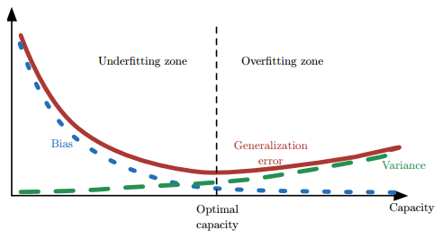
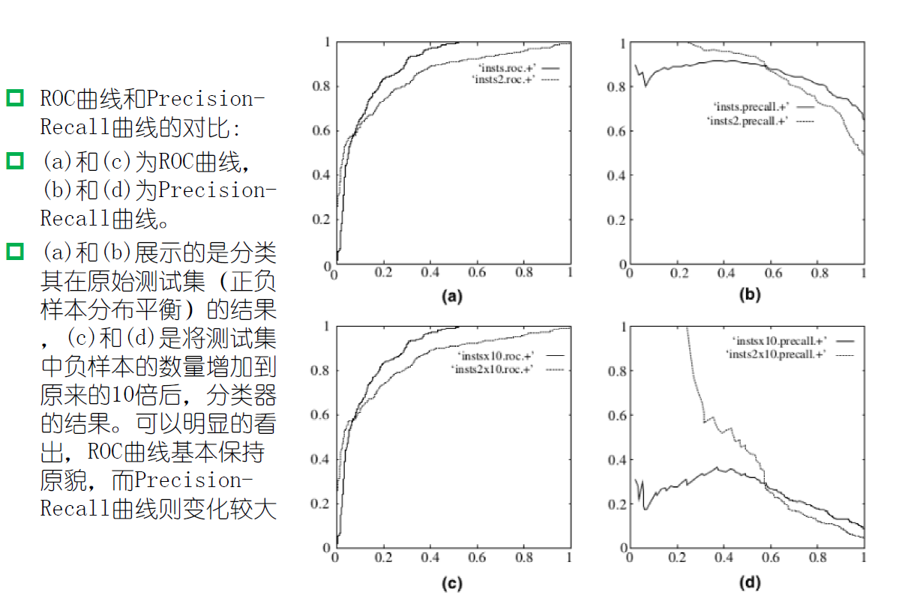

# 模型的评估与选择

## 误差与过拟合

我们将学习器对样本的实际预测结果与样本的真实值之间的差异成为：误差（error）。定义：	

 - 在训练集上的误差称为训练误差（training error）或经验误差（empirical error）。
 - 在测试集上的误差称为测试误差（test error）。
 - 学习器在所有新样本上的误差称为泛化误差（generalization error）。

显然，我们希望得到的是在新样本上表现得很好的学习器，即泛化误差小的学习器。因此，我们应该让学习器尽可能地从训练集中学出普适性的“一般特征”，这样在遇到新样本时才能做出正确的判别。然而，当学习器把训练集学得“太好”的时候，即把一些训练样本的自身特点当做了普遍特征；同时也有学习能力不足的情况，即训练集的基本特征都没有学习出来。我们定义：

 - 学习能力过强，以至于把训练样本所包含的不太一般的特性都学到了，称为：过拟合（overfitting）。
 - 学习能太差，训练样本的一般性质尚未学好，称为：欠拟合（underfitting）。

##  方差与偏差

- **偏差**与**方差**分别是用于衡量一个模型**泛化误差**的两个方面；
  - 模型的**偏差**，指的是模型预测的**期望值**与**真实值**之间的差；
  - 模型的**方差**，指的是模型预测的**期望值**与**预测值**之间的差平方和；

- 在**监督学习**中，模型的**泛化误差**可**分解**为偏差、方差与噪声之和。

  $$
  Err(x) = Bias^2 + Variance + Noise
  $$

- **偏差**用于描述模型的**拟合能力**
  **方差**用于描述模型的**稳定性**

- 偏差：`Bias`反映的是模型在样本上的输出与真实值之间的误差，即模型本身的精准度，即算法本身的拟合能力
- 方差：`Variance`反映的是模型每一次输出结果与模型输出期望之间的误差，即模型的稳定性。反应预测的波动情况。
- 误差：`Err(x)` 也叫泛化误差
- 欠拟合会出现高偏差问题
- 过拟合会出现高方差问题

### 1.1 导致偏差和方差的原因

- 偏差通常是由于我们对学习算法做了错误的假设，或者模型的复杂度不够；
  - 比如真实模型是一个二次函数，而我们假设模型为一次函数，这就会导致偏差的增大（欠拟合）；
  - **由偏差引起的误差**通常在**训练误差**上就能体现，或者说训练误差主要是由偏差造成的
- 方差通常是由于模型的复杂度相对于训练集过高导致的；
  - 比如真实模型是一个简单的二次函数，而我们假设模型是一个高次函数，这就会导致方差的增大（过拟合）；
  - **由方差引起的误差**通常体现在测试误差相对训练误差的**增量**上。

### 1.2 深度学习中的偏差与方差

- 神经网络的拟合能力非常强，因此它的**训练误差**（偏差）通常较小；
- 但是过强的拟合能力会导致较大的方差，使模型的测试误差（**泛化误差**）增大；
- 因此深度学习的核心工作之一就是研究如何降低模型的泛化误差，这类方法统称为**正则化方法**。

### 1.3 偏差与方差的计算公式

- 记在**训练集 D** 上学得的模型为
$$
  f(x;D)
$$
  
  模型的**期望预测**为
$$
f(x) = E_D[f(x;D)]
$$
  
- **偏差**（Bias）
$$
Bias^2(x) = \left(f(x) - y \right)^2
$$
  > **偏差**度量了学习算法的期望预测与真实结果的偏离程度，即刻画了学习算法本身的拟合能力；

- **方差**（Variance）
$$
var(x) = E_D\left[ \left( f(x;D)-f(x)\right)^2\right]
$$
  
  > **方差**度量了同样大小的**训练集的变动**所导致的学习性能的变化，即刻画了数据扰动所造成的影响（模型的稳定性）；

- **噪声**则表达了在当前任务上任何学习算法所能达到的期望泛化误差的下界，即刻画了学习问题本身的难度。
- “**偏差-方差分解**”表明模型的泛化能力是由算法的能力、数据的充分性、任务本身的难度共同决定的。

### 1.5 偏差与方差的权衡（过拟合与模型复杂度的权衡）

- 给定学习任务，

  - 当训练不足时，模型的**拟合能力不够**（数据的扰动不足以使模型产生显著的变化），此时**偏差**主导模型的泛化误差；
  - 随着训练的进行，模型的**拟合能力增强**（模型能够学习数据发生的扰动），此时**方差**逐渐主导模型的泛化误差；
  - 当训练充足后，模型的**拟合能力过强**（数据的轻微扰动都会导致模型产生显著的变化），此时即发生**过拟合**（训练数据自身的、非全局的特征也被模型学习了）

- 偏差和方差的关系和**模型容量**（模型复杂度）、**欠拟合**和**过拟合**的概念紧密相联

  

  - 当模型的容量增大（x 轴）时， 偏差（用点表示）随之减小，而方差（虚线）随之增大
  - 沿着 x 轴存在**最佳容量**，**小于最佳容量会呈现欠拟合**，**大于最佳容量会导致过拟合**。

  > 《深度学习》 5.4.4 权衡偏差和方差以最小化均方误差

### 1.6 防止过拟合方法

- 参数范数惩罚（Parameter Norm Penalties）
- 数据增强（Dataset Augmentation）
- 提前终止（Early Stopping）
- 参数绑定与参数共享（Parameter Tying and Parameter Sharing）
- Bagging 和其他集成方法
- Dropout
- 批标准化（Batch Normalization）

## 评估方法

在现实任务中，我们往往有多种算法可供选择，那么我们应该选择哪一个算法才是最适合的呢？如上所述，我们希望得到的是泛化误差小的学习器，理想的解决方案是对模型的泛化误差进行评估，然后选择泛化误差最小的那个学习器。但是，泛化误差指的是模型在所有新样本上的适用能力，我们无法直接获得泛化误差。

因此，通常我们采用一个“测试集”来测试学习器对新样本的判别能力，然后以“测试集”上的“测试误差”作为“泛化误差”的近似。显然：我们选取的测试集应尽可能与训练集互斥，下面用一个小故事来解释why：

假设老师出了10 道习题供同学们练习，考试时老师又用同样的这10道题作为试题，可能有的童鞋只会做这10 道题却能得高分，很明显：这个考试成绩并不能有效地反映出真实水平。回到我们的问题上来，我们希望得到泛化性能好的模型，好比希望同学们课程学得好并获得了对所学知识"举一反三"的能力；训练样本相当于给同学们练习的习题，测试过程则相当于考试。显然，若测试样本被用作训练了，则得到的将是过于"乐观"的估计结果。

**2.3 训练集与测试集的划分方法**

如上所述：我们希望用一个“测试集”的“测试误差”来作为“泛化误差”的近似，因此我们需要对初始数据集进行有效划分，划分出互斥的“训练集”和“测试集”。下面介绍几种常用的划分方法：

**2.3.1 留出法**

将数据集D划分为两个互斥的集合，一个作为训练集S，一个作为测试集T，满足D=S∪T且S∩T=∅，常见的划分为：大约2/3-4/5的样本用作训练，剩下的用作测试。需要注意的是：训练/测试集的划分要尽可能保持数据分布的一致性，以避免由于分布的差异引入额外的偏差，常见的做法是采取分层抽样。同时，由于划分的随机性，单次的留出法结果往往不够稳定，一般要采用若干次随机划分，重复实验取平均值的做法。

**2.3.2 交叉验证法**

将数据集D划分为k个大小相同的互斥子集，满足D=D1∪D2∪...∪Dk，Di∩Dj=∅（i≠j），同样地尽可能保持数据分布的一致性，即采用分层抽样的方法获得这些子集。交叉验证法的思想是：每次用k-1个子集的并集作为训练集，余下的那个子集作为测试集，这样就有K种训练集/测试集划分的情况，从而可进行k次训练和测试，最终返回k次测试结果的均值。交叉验证法也称“k折交叉验证”，k最常用的取值是10，下图给出了10折交叉验证的示意图。

与留出法类似，将数据集D划分为K个子集的过程具有随机性，因此K折交叉验证通常也要重复p次，称为p次k折交叉验证，常见的是10次10折交叉验证，即进行了100次训练/测试。特殊地当划分的k个子集的每个子集中只有一个样本时，称为“留一法”，显然，留一法的评估结果比较准确，但对计算机的消耗也是巨大的。

**2.3.3 自助法**

我们希望评估的是用整个D训练出的模型。但在留出法和交叉验证法中，由于保留了一部分样本用于测试，因此实际评估的模型所使用的训练集比D小，这必然会引入一些因训练样本规模不同而导致的估计偏差。留一法受训练样本规模变化的影响较小，但计算复杂度又太高了。“自助法”正是解决了这样的问题。

自助法的基本思想是：给定包含m个样本的数据集D，每次随机从D 中挑选一个样本，将其拷贝放入D'，然后再将该样本放回初始数据集D 中，使得该样本在下次采样时仍有可能被采到。重复执行m 次，就可以得到了包含m个样本的数据集D'。可以得知在m次采样中，样本始终不被采到的概率取极限为：

这样，通过自助采样，初始样本集D中大约有36.8%的样本没有出现在D'中，于是可以将D'作为训练集，D-D'作为测试集。自助法在数据集较小，难以有效划分训练集/测试集时很有用，但由于自助法产生的数据集（随机抽样）改变了初始数据集的分布，因此引入了估计偏差。在初始数据集足够时，留出法和交叉验证法更加常用。

**2.5 性能度量**

性能度量（performance measure）是衡量模型泛化能力的评价标准，在对比不同模型的能力时，使用不同的性能度量往往会导致不同的评判结果。本节除2.5.1外，其它主要介绍分类模型的性能度量。

**2.5.1 最常见的性能度量**

在回归任务中，即预测连续值的问题，最常用的性能度量是“均方误差”（mean squared error）,很多的经典算法都是采用了MSE作为评价函数，想必大家都十分熟悉。

在分类任务中，即预测离散值的问题，最常用的是错误率和精度，错误率是分类错误的样本数占样本总数的比例，精度则是分类正确的样本数占样本总数的比例，易知：错误率+精度=1。

### 分类评价指标

**混淆矩阵**

- True Positive(TP)：将正类预测为正类的数量.
- True Negative(TN)：将负类预测为负类的数量.
- False Positive(FP)：将负类预测为正类数 → 误报 (Type I error).
- False Negative(FN)：将正类预测为负类数 → 漏报 (Type II error).

**准确率**（accuracy）
$$
ACC = \frac{TP+TN}{TP+TN+FP+FN}
$$

**精确率**（precision）【查准率】

$$
P = \frac{TP}{TP+FP}
$$

> 准确率与精确率的区别：
>
> > 在正负样本不平衡的情况下，**准确率**这个评价指标有很大的缺陷。比如在互联网广告里面，点击的数量是很少的，一般只有千分之几，如果用acc，即使全部预测成负类（不点击）acc 也有 99% 以上，没有意义。

**召回率**（recall, sensitivity, true positive rate）【查全率】
$$
R = \frac{TP}{TP+FN}
$$

**F1值**——精确率和召回率的调和均值

$$
\frac{2}{F_1} = \frac{1}{P} + \frac{1}{R}
$$
$$
F_1 = \frac{2TP}{2TP+FP+FN}
$$

> 只有当精确率和召回率都很高时，F1值才会高

**ROC**

**ROC曲线**：接收者操作特征曲线（[receiver operating characteristic curve](https://en.wikipedia.org/wiki/Receiver_operating_characteristic)），是反映敏感性和特异性连续变量的综合指标，roc曲线上每个点反映着对同一信号刺激的感受性。

对于分类器，或者说分类算法，评价指标主要有precision，recall，F-score等，以及这里要讨论的ROC和AUC。下图是一个ROC曲线的示例：

- 横坐标：**1-Specificity**，伪正类率(False positive rate， FPR)，**预测为正但实际为负**的样本占**所有负例样本**的比例；
$$
FPR = \frac{FP}{TN+FP}
$$
- 纵坐标：**Sensitivity**，真正类率(True positive rate， TPR)，**预测为正且实际为正**的样本占**所有正例样本**的比例。
$$
TPR = \frac{TP}{TP+FN}
$$
在一个二分类模型中，假设采用逻辑回归分类器，其给出针对每个实例为正类的概率，那么通过设定一个阈值如0.6，概率大于等于0.6的为正类，小于0.6的为负类。对应的就可以算出一组(FPR,TPR)，在平面中得到对应坐标点。随着阈值的逐渐减小，越来越多的实例被划分为正类，但是这些正类中同样也掺杂着真正的负实例，即TPR和FPR会同时增大。阈值最大时，对应坐标点为(0,0)，阈值最小时，对应坐标点(1,1)。

如下面这幅图，(a)图中实线为ROC曲线，线上每个点对应一个阈值。

(a) 理想情况下，TPR应该接近1，FPR应该接近0。ROC曲线上的每一个点对应于一个threshold，对于一个分类器，每个threshold下会有一个TPR和FPR。比如Threshold最大时，TP=FP=0，对应于原点；Threshold最小时，TN=FN=1，对应于右上角的点(1,1)。
(b) P和N得分不作为特征间距离d的一个函数，随着阈值theta增加，TP和FP都增加。

- 横轴FPR：1-TNR，1-Specificity，FPR越大，预测正类中实际负类越多。
- 纵轴TPR：Sensitivity(正类覆盖率)，TPR越大，预测正类中实际正类越多。
- 理想目标：TPR=1，FPR=0，即图中(0,1)点，故ROC曲线越靠拢(0,1)点，越偏离45度对角线越好，Sensitivity、Specificity越大效果越好。

**AUC**

AUC ([Area Under Curve](https://en.wikipedia.org/wiki/Receiver_operating_characteristic#Area_under_the_curve)) 被定义为**ROC曲线下的面积**，显然这个面积的数值**不会大于1**。又由于ROC曲线一般都处于 `y=x` 这条直线的上方，所以**AUC的取值范围一般在0.5和1之间**。

**使用AUC值作为评价标准是因为很多时候ROC曲线并不能清晰的说明哪个分类器的效果更好，而作为一个数值，对应AUC更大的分类器效果更好。**

AUC的计算有两种方式，**梯形法**和**ROC AUCH法**，都是以逼近法求近似值，具体见[wikipedia](https://en.wikipedia.org/wiki/Receiver_operating_characteristic#Area_under_the_curve)。

**AUC意味着什么**

那么AUC值的含义是什么呢？根据(Fawcett, 2006)，AUC的值的含义是：

> The AUC value is equivalent to the probability that a randomly chosen positive example is ranked higher than a randomly chosen negative example.

这句话有些绕，我尝试解释一下：首先AUC值是一个概率值，当你随机挑选一个正样本以及一个负样本，当前的分类算法根据计算得到的Score值将这个正样本排在负样本前面的概率就是AUC值。当然，**AUC值越大，当前的分类算法越有可能将正样本排在负样本前面，即能够更好的分类**。

从AUC判断分类器（预测模型）优劣的标准：

- AUC = 1，是完美分类器，采用这个预测模型时，存在至少一个阈值能得出完美预测。绝大多数预测的场合，不存在完美分类器。
- 0.5 < AUC < 1，优于随机猜测。这个分类器（模型）妥善设定阈值的话，能有预测价值。
- AUC = 0.5，跟随机猜测一样（例：丢铜板），模型没有预测价值。
- AUC < 0.5，比随机猜测还差；但只要总是反预测而行，就优于随机猜测。

三种AUC值示例：

简单说：**AUC值越大的分类器，正确率越高**。

**为什么使用ROC曲线**

既然已经这么多评价标准，为什么还要使用ROC和AUC呢？

因为ROC曲线有个很好的特性：**当测试集中的正负样本的分布变化的时候，ROC曲线能够保持不变**。在实际的数据集中经常会出现类不平衡（class imbalance）现象，即负样本比正样本多很多（或者相反），而且测试数据中的正负样本的分布也可能随着时间变化。

**2.5.4 代价敏感错误率与代价曲线**

上面的方法中，将学习器的犯错同等对待，但在现实生活中，将正例预测成假例与将假例预测成正例的代价常常是不一样的，例如：将无疾病-->有疾病只是增多了检查，但有疾病-->无疾病却是增加了生命危险。以二分类为例，由此引入了“代价矩阵”（cost matrix）。

在非均等错误代价下，我们希望的是最小化“总体代价”，这样“代价敏感”的错误率（2.5.1节介绍）为：

同样对于ROC曲线，在非均等错误代价下，演变成了“代价曲线”，代价曲线横轴是取值在[0,1]之间的正例概率代价，式中p表示正例的概率，纵轴是取值为[0,1]的归一化代价。

代价曲线的绘制很简单：设ROC曲线上一点的坐标为(TPR，FPR) ，则可相应计算出FNR，然后在代价平面上绘制一条从(0，FPR) 到(1，FNR) 的线段，线段下的面积即表示了该条件下的期望总体代价；如此将ROC 曲线土的每个点转化为代价平面上的一条线段，然后取所有线段的下界，围成的面积即为在所有条件下学习器的期望总体代价，如图所示：

在此模型的性能度量方法就介绍完了，以前一直以为均方误差和精准度就可以了，现在才发现天空如此广阔~
## 假设检验
这里略过，其原因是在实际中我没有遇到过，根据西瓜书中写的，主要是考虑：
1. 泛化误差和测试误差并不是一致的。（在实际中我们一般就使用测试误差来表示了泛化误差）
2. 因此有必要考虑模型的泛化误差。
