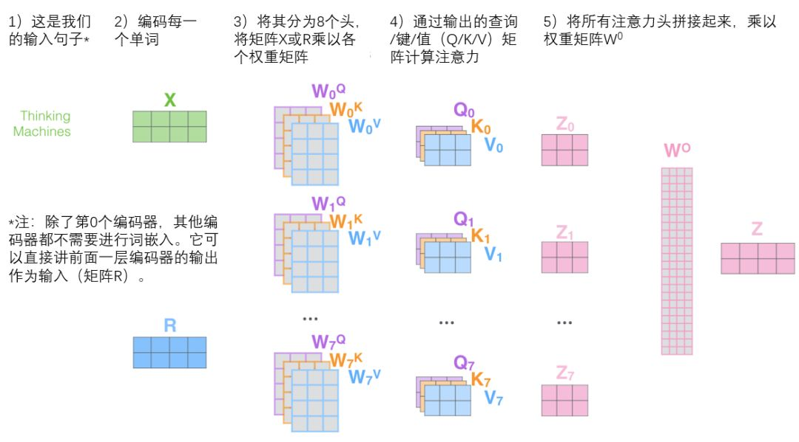

# GRU

完整版GRU：

$$
\tilde{c}^{<t>}=\tanh(W_c[\Gamma_r * c^{<t-1>}, x^{<t>}]+b_c)
\\
\Gamma_u = \sigma(W_u[c^{<t-1>}, x^{<t>}]+b_u)
\\
\Gamma_r = \sigma(W_r[c^{<t-1>}, x^{<t>}]+b_r)
\\
c^{<t>} = \Gamma_u * \tilde{c}^{t} + (1- \Gamma_u)*c^{<t-1>}
\\
c^{<t>} = a^{<t>}
$$
更新门$\Gamma_u$, 重置门$\Gamma_r$, 当前记忆候选内容$\tilde{c}^{<t>}$, 本轮记忆内容$c^{<t>}$, 激活函数output值与本轮记忆内容一致$c^{<t>} = a^{<t>}$.

# LSTM

GRU能够让我们在序列中学习到更深的联系，长短期记忆（long short-term memory, LSTM）对捕捉序列中更深层次的联系要比GRU更加有效。

LSTM中，使用了单独的更新门$\Gamma_u$和遗忘门$\Gamma_f$，以及一个输出门$\Gamma_o$，其主要的公式如下：
$$
\tilde{c}^{<t>}=\tanh(W_c[a^{<t-1>}, x^{<t>}]+b_c)
\\
\Gamma_u = \sigma(W_u[c^{<t-1>}, x^{<t>}]+b_u)
\\
\Gamma_f = \sigma(W_r[c^{<t-1>}, x^{<t>}]+b_f)
\\
\Gamma_o = \sigma(W_o[c^{<t-1>}, x^{<t>}]+b_o)
\\
c^{<t>} = \Gamma_u * \tilde{c}^{t} + \Gamma_f*c^{<t-1>}
\\
a^{<t>} = \Gamma_o * \tanh c^{<t>}
$$

GRU 与 LSTM 的比较，注意这里公式与上面不相同，但实质是一样的.

## LSTM 为什么能解决梯度消失/爆炸的问题 ？

1. 3个门的激活函数是sigmoid， 这保证了其输出值在0或1附近.
2. 这样3个门会保证前面若干轮的梯度值可以被记忆到后面序列的单元，这样就解决了梯度问题.
   
## LSTM 的不足之处

# Transformer
参考BLOG：https://jalammar.github.io/illustrated-transformer/ (翻墙)

Transformer与一般的seq2seq模型类似，都是encoder+decoder的组合.

Transformer是6个encoder和6个decoder堆叠而成.

每个encoder和decoder的内部结构如下:

## Self-Attention

如何获得Q,K,V?

多头注意力机制下，每个头内的QKV独立计算.

## 残差和layer_norm

## encoder-decoder
顶部的encoder会把KV共享传入decoder.

## 位置编码

## 整体流程

注意:decoder第一个self-attention是Masked， 意味着当时间t时只有序列t的单词能够显示，其余都被赋值为-Inf，即被masked. 

## 写出  Attention 的公式
$$
Attention(Q,K,V) = softmax\left(\frac{QK^T}{\sqrt{d_k}}\right)V
$$

1. $Q,K,V$分别指**Query**, **Key**, **Value**.
2. 每个输入的词向量的$Q,K,V$向量是由**该输入的词向量**分别与权重矩阵$W_q,W_k,W_v$做相乘计算得到.
3. 通过当前位置的Q与其他位置的K相乘，可以得到当前位置对**目标位置的attention权重**.
4. 再将这个attention权重（经过**softmax**规整化后）与目标位置的V相乘，就得到了当前位置对**目标位置的attention编码**.
5. 将当前位置对所有位置（包括他自己）attention编码相加就得到了**当前位置的输出编码**.
   
## Self-Attention的时间复杂度
假设输入的序列是n，d为Embedding 的维度。那么 Self-Attention 的时间复杂度是 $O(n^2·d)$. 根据上面的公式.

1. 对于相似度的计算是Q，K做点乘，其实就是看出矩阵$(n, d) * (d, n) = O(n^2 ·d)$, 得到一个(n,n)的矩阵。
2. softmax的计算，时间复杂度为$O(n)$
   

## Transformer中使用多头的好处？
将模型分成多个头，形成多个子空间，可以让模型去关注不同方面的信息，从而捕捉更加丰富特征。

## Transformer中使用LayerNorm而不是BatchNorm？

**说简单点，其实深度学习里的正则化方法就是 "通过把一部分不重要的复杂信息损失掉，以此来降低拟合难度以及过拟合的风险，从而加速了模型的收敛"。**

**Normalization目的就是让分布稳定下来（降低各维度数据的方差）。 不同正则化方法的区别只是操作的信息维度不同，即选择损失信息的维度不同。**

在CV中常常使用BN，它是在NHW维度进行了归一化，而Channel维度的信息原封不动，因为可以认为在CV应用场景中，数据在不同channel中的信息很重要，如果对其进行归一化将会损失不同channel的差异信息。 

而NLP中不同batch样本的信息关联性不大，而且由于不同的句子长度不同，强行归一化会损失不同样本间的差异信息，所以就没在batch维度进行归一化，而是选择LN，只考虑的句子内部维度的归一化。 可以认为NLP应用场景中一个样本内部维度间是有关联的，所以在信息归一化时，对样本内部差异信息进行一些损失，反而能降低方差。

 **总结一下**：选择什么样的归一化方式，取决于你关注数据的哪部分信息。如果某个维度信息的差异性很重要，需要被拟合，那就别在那个维度进行归一化。

 ## Self-Attention中的计算为什么要使用根号dk缩放
 假设两个$𝑑_𝑘$维向量每个分都是一相互独立的服从 **标准正态分布** 的随机变量，那 么他们的点乘结果会变得很大，并且服从**均值为 0，方差为**$𝒅_𝒌$的分布，而很大的点乘 会让 Softmax 函数处在 梯度很小的区域（我们在讲 Softmax 和 Sigmoid 关系的时候 讲过，面对二分类情况的时候 Softmax 就退化成了 Sigmoid 函数；我们知道 Sigmoid 函数在输入值较大的区域存梯度饱和现象） ，对每一个分量除以 𝑠𝑞𝑟𝑡(𝑑k)可 以让点乘的**方差变成1**.

## 为什么 self-attention model在长距离序列中如此强大？

1. 没有因梯度消失而导致的**长序列信息**“遗忘”的问题；
2. 采用 **全局编码** 的方式来避免类似于 CNN 所产生的局部依赖问题；
3.  利用 Word Embedding + Position 相结合的方式来处理文本中序列信息；
4.  利用 **注意力机制** 来“动态”地生成不同连接的权重，从而处理变长信息序列。
