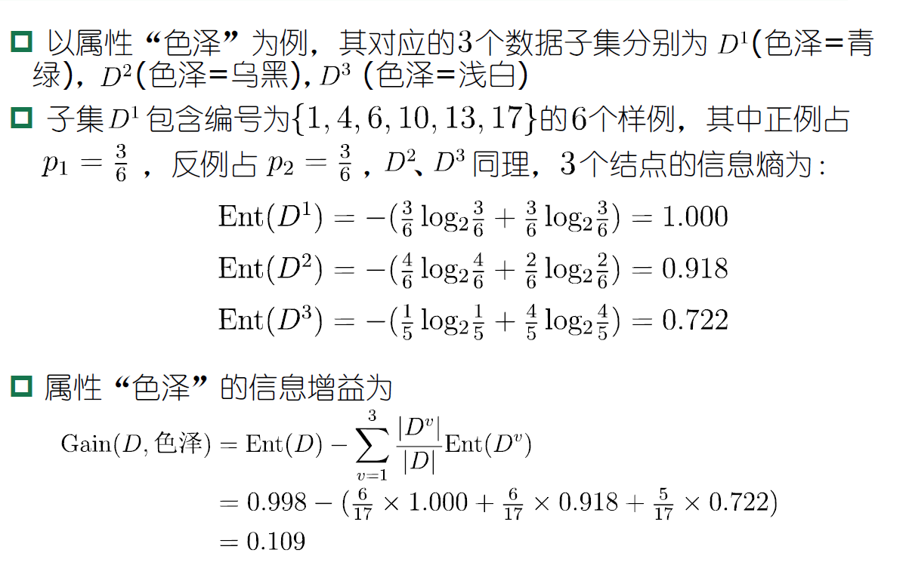
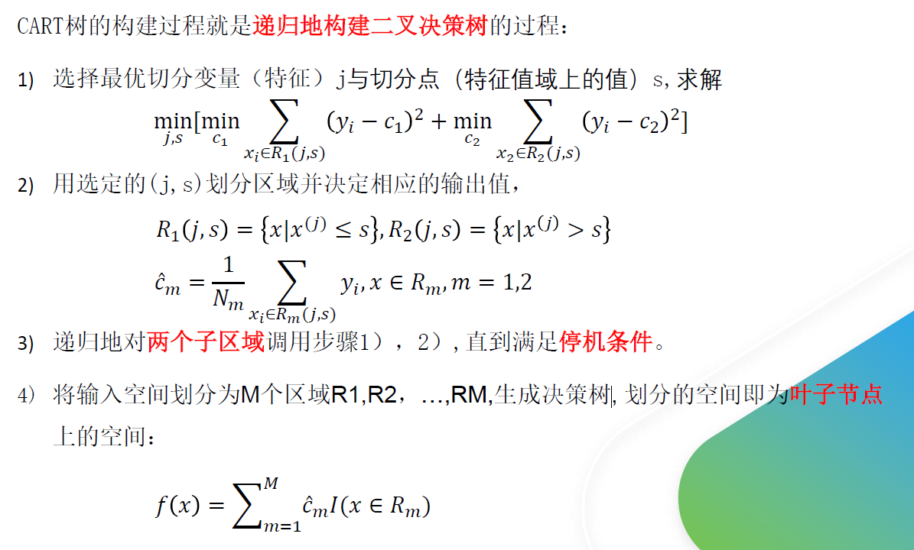
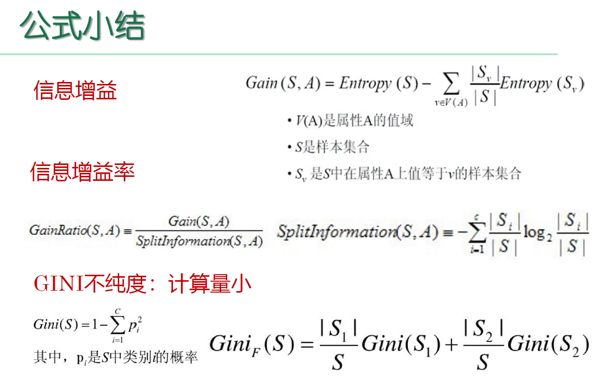

# 决策树

## 决策树的构造

决策树的构造是一个递归的过程，有三种情形会导致递归返回：(1) 当前结点包含的样本全属于同一类别，这时直接将该节点标记为叶节点，并设为相应的类别；(2) 当前属性集为空，或是所有样本在所有属性上取值相同，无法划分，这时将该节点标记为叶节点，并将其类别设为该节点所含样本最多的类别；(3) 当前结点包含的样本集合为空，不能划分，这时也将该节点标记为叶节点，并将其类别设为父节点中所含样本最多的类别。算法的基本流程如下图所示：

可以看出：决策树学习的关键在于如何选择划分属性，不同的划分属性得出不同的分支结构，从而影响整颗决策树的性能。属性划分的目标是让各个划分出来的子节点尽可能地“纯”，即属于同一类别。因此下面便是介绍量化纯度的具体方法，决策树最常用的算法有三种：ID3，C4.5和CART。

## ID3算法

ID3算法使用信息增益为准则来选择划分属性，“信息熵”(information entropy)是度量样本结合纯度的常用指标，假定当前样本集合D中第k类样本所占比例为pk，则样本集合D的信息熵定义为：

假定通过属性划分样本集D，产生了V个分支节点，v表示其中第v个分支节点，易知：分支节点包含的样本数越多，表示该分支节点的影响力越大。故可以计算出划分后相比原始数据集D获得的“信息增益”（information gain）。

信息增益越大，表示使用该属性划分样本集D的效果越好，因此ID3算法在递归过程中，每次选择最大信息增益的属性作为当前的划分属性。

这里给出西瓜书的一个具体计算，方便查看

## C4.5算法

信息增益对 可取值数目较多的属性 有所偏好

ID3算法存在一个问题，就是偏向于取值数目较多的属性，例如：如果存在一个唯一标识，这样样本集D将会被划分为|D|个分支，每个分支只有一个样本，这样划分后的信息熵为零，十分纯净，但是对分类毫无用处。因此C4.5算法使用了“增益率”（gain ratio）来选择划分属性，来避免这个问题带来的困扰。首先使用ID3算法计算出信息增益高于平均水平的候选属性，接着C4.5计算这些候选属性的增益率，增益率定义为：

## CART算法

CART决策树使用“基尼指数”（Gini index）来选择划分属性，基尼指数反映的是从样本集D中随机抽取两个样本，其类别标记不一致的概率，因此Gini(D)越小越好，基尼指数定义如下：

进而，使用属性α划分后的基尼指数为：

## CART回归树

# 公式小结

​    

