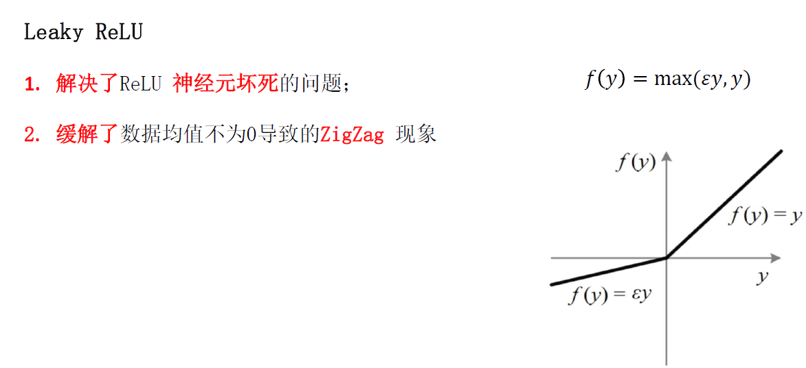
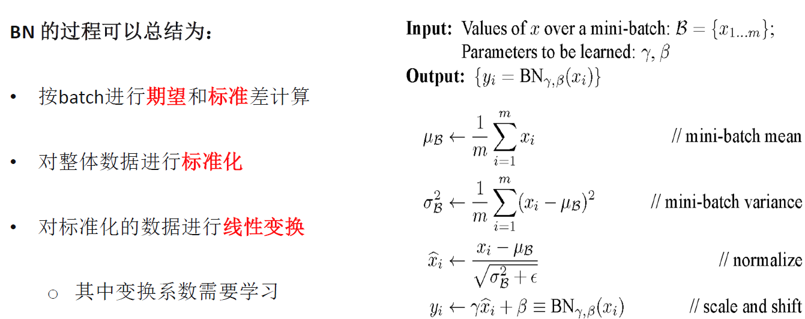
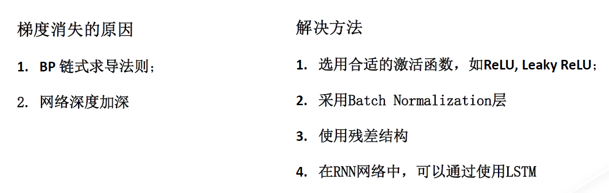
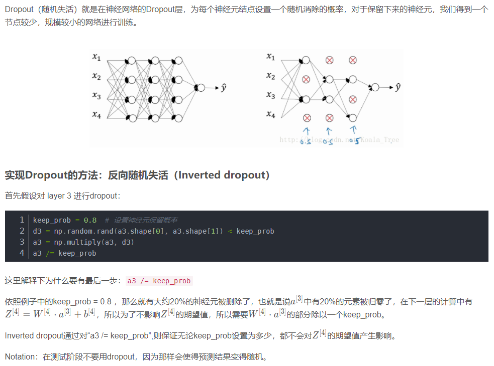

# 深度学习基础

## 激活函数
1. 用激活函数可以 增强 网络的 表现力
2. 不用激活函数整个网络会 退化成线性函数
3. 常用的激活函数有： Sigmoid, Tanh, ReLU, Leaky ReLU
### ReLU
优缺点

### Leaky ReLU

### Sigmoid

### Tanh

## Batch Normalization

### BN的实现
注意BN是根据mini-batch对神经网络的**隐藏层输出z**进行标准化. 有两个参数进行学习. 在**测试时**通常取期望和方差的加权平均.

### BN的作用

Covariate Shift 数据分布问题.

## 梯度消失与梯度爆炸

### 利用初始化缓解
Xavier initialization : $var(w_i) = \frac{1}{n}$

这么做是因为，如果激活函数的输入x近似设置成均值为0，标准方差1的情况，输出z 也会调整到相似的范围内。虽然**没有解决**梯度消失和爆炸的问题，但其在**一定程度**上确实减缓了梯度消失和爆炸的速度。

### 解决

## Dropout

## softmax
值得注意的是softmax的输入尺寸是(1, n), n是上一层隐藏层的个数, sigmoid的输入是(1,1)

## 梯度下降的方法

## 指数加权平均
指数加权平均的关键函数：
$$
    v_t = \beta v_{t-1}+(1-\beta)\theta
$$

### 理解指数加权平均
例子，当$β = 0.9$ 时：

$$
v_{100} = 0.9v_{99} + 0.1\theta_{100} 
\\
v_{99} = 0.9v_{98} + 0.1\theta_{99} 
\\
v_{98} = 0.9v_{97} + 0.1\theta_{98} 
\\
...
$$
总体来说存在，$(1-\epsilon )^{1/\epsilon} = \frac{1}{e}$, 在我们的例子中，$1-\epsilon = \beta = 0.9$, 即$0.9^{10} \approx 0.35 \approx \frac{1}{e}$. 相当于大约10天后，系数的峰值（这里是0.1）下降到原来的 $\frac{1}{e}$，只关注了过去10天的天气。

### 指数加权平均的偏差修正

偏差修正：

$$
    v_t = \frac{v_t}{1-\beta^t}
$$

## 动量（Momentum）梯度下降法
算法:

## RMSprop

## Adam

