# 朴素贝叶斯

## 条件概率，全概率公式与贝叶斯公

>条件概率  
>
>$P(A|B) = \frac{P(A \cap B)}{P(B)}$
>    
>$P(A \cap B) = P(A|B) P(B)$
>   
>$P(B \cap A) = P(B|A) P(A)$

> 贝叶斯公式
> 
> $P(A|B) = \frac{P(B|A)P(A)}{P(B)}$

> 全概率公式
>
> $P(A) =\sum_nP(A|B_n)P(B_n)$

>将全概率代入贝叶斯
>
>$P(A|B) = \frac{P(B|A)P(A)}{\sum_nP(B|A_n)P(A_n)}$

 ## 贝叶斯决策论

关于西瓜书上风险这一块，自己看书，具体意思就是贝叶斯决策论就是**选概率最大**那个.

	* 判别式模型：直接对 P（c | x）进行建模求解。例我们前面所介绍的决策树、神经网络、SVM都是属于判别式模型。
	* 生成式模型：通过先对联合分布P（x,c）建模，从而进一步求解 P（c | x）。

贝叶斯分类器就属于生成式模型.

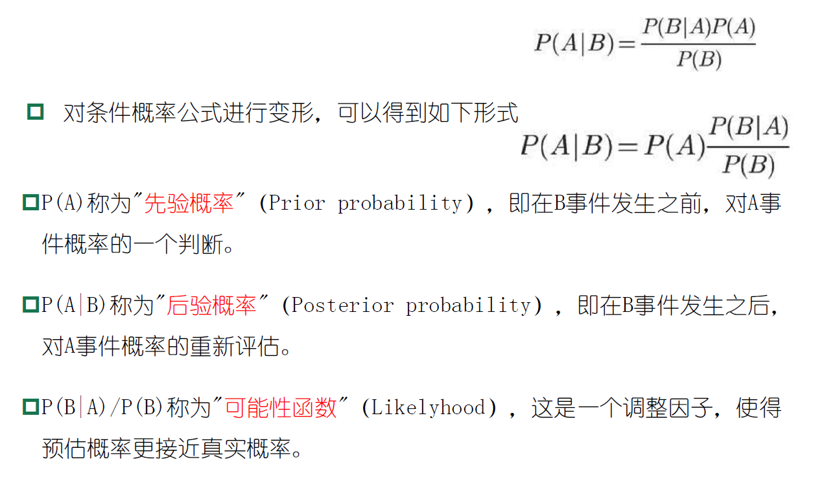

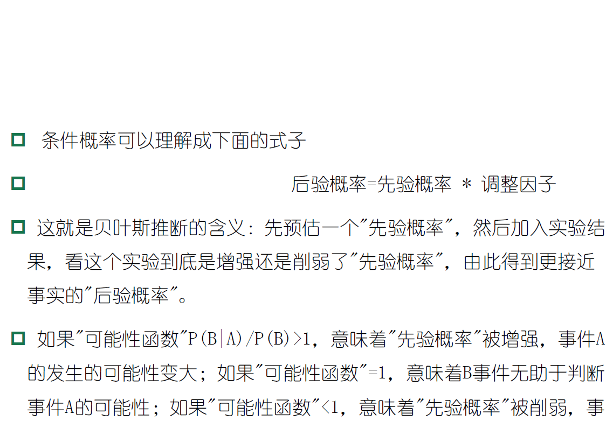

## 极大似然估计
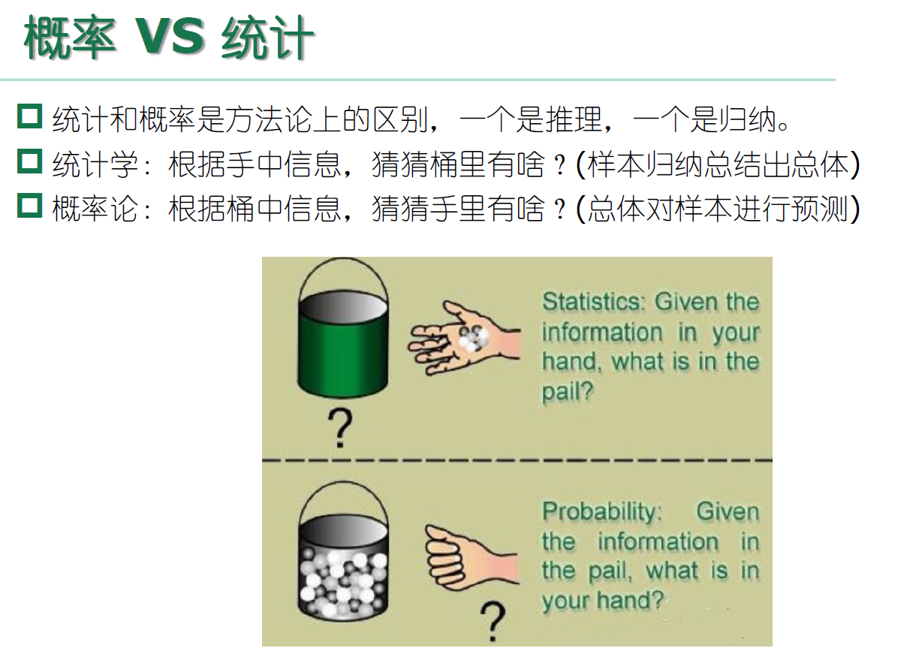

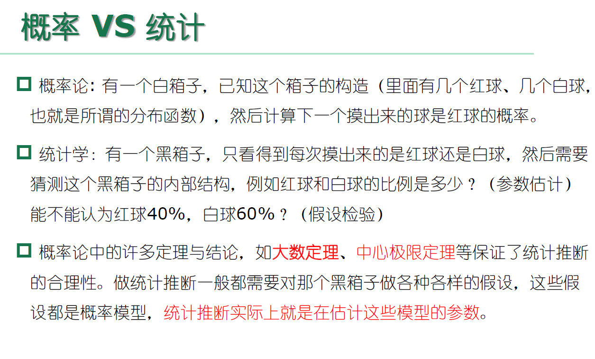

>估计类条件概率的常用策略：先假定其具有某种确定的概率分布形式，再基于训练样本对概率分布参数估计.
>
>
>例如：假设样本属性都是连续值，p（x | c ）服从一个多维高斯分布，则通过MLE计算出的参数刚好分别为：
>
>

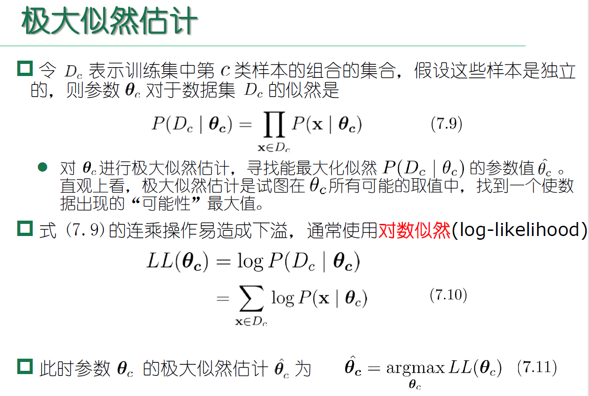

## 朴素贝叶斯

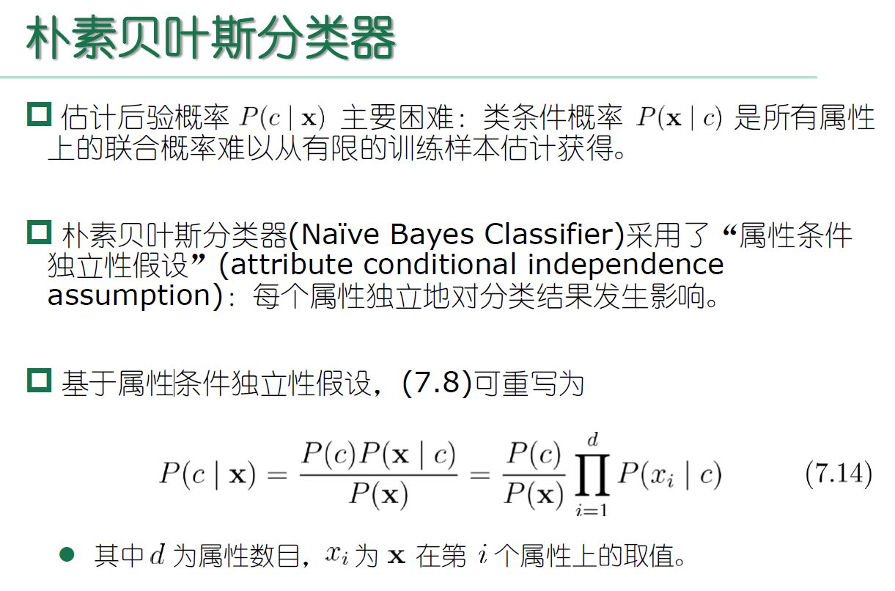
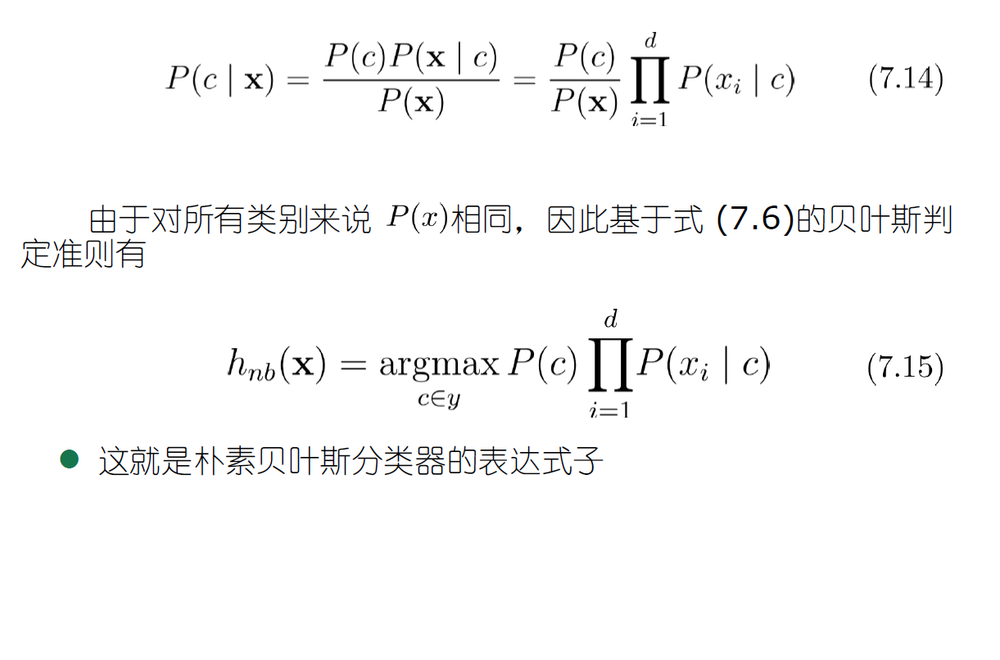

相比原始贝叶斯分类器，朴素贝叶斯分类器基于单个的属性计算类条件概率更加容易操作，需要注意的是：若某个属性值在训练集中和某个类别没有一起出现过，这样会抹掉其它的属性信息，因为该样本的类条件概率被计算为0。因此在估计概率值时，常常用进行平滑（smoothing）处理，拉普拉斯修正（Laplacian correction）就是其中的一种经典方法，具体计算方法如下：

当训练集越大时，拉普拉斯修正引入的影响越来越小。对于贝叶斯分类器，模型的训练就是参数估计，因此可以事先将所有的概率储存好，当有新样本需要判定时，直接查表计算即可。

针对朴素贝叶斯，人们觉得它too sample，sometimes too naive！因此又提出了半朴素的贝叶斯分类器，具体有SPODE、TAN、贝叶斯网络等来刻画属性之间的依赖关系，此处不进行深入.

## EM算法
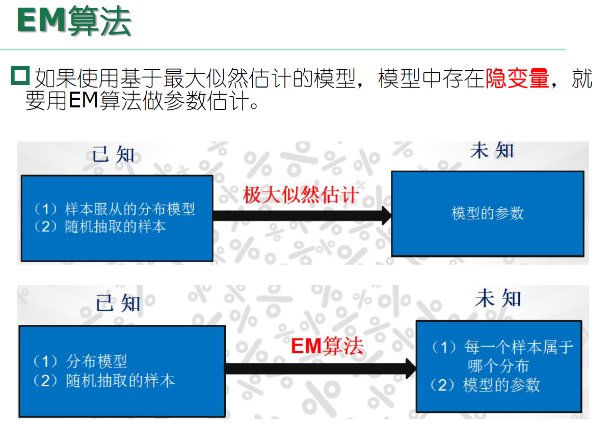
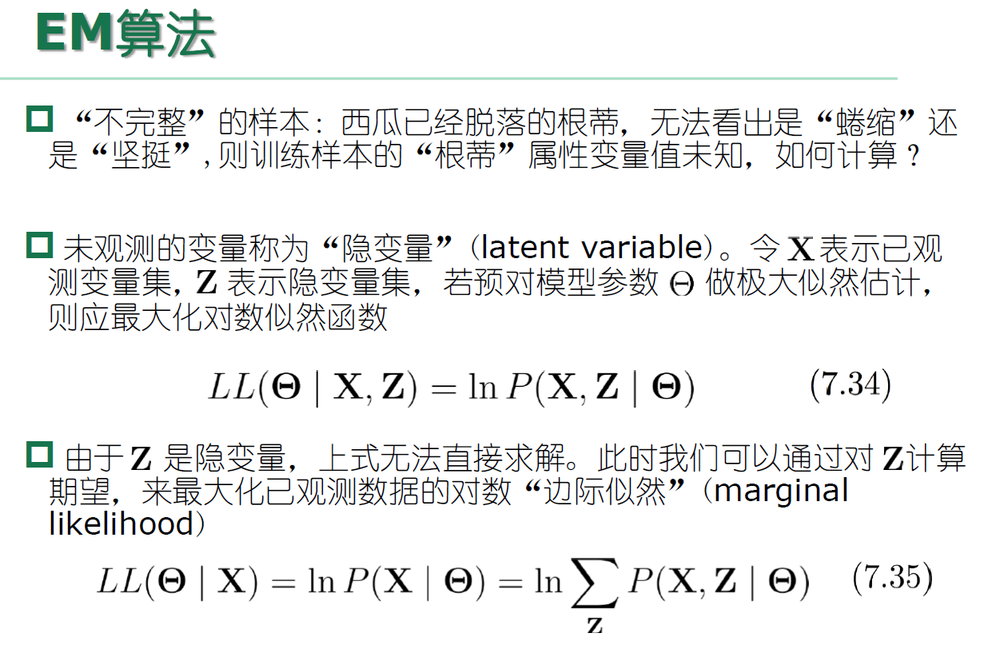
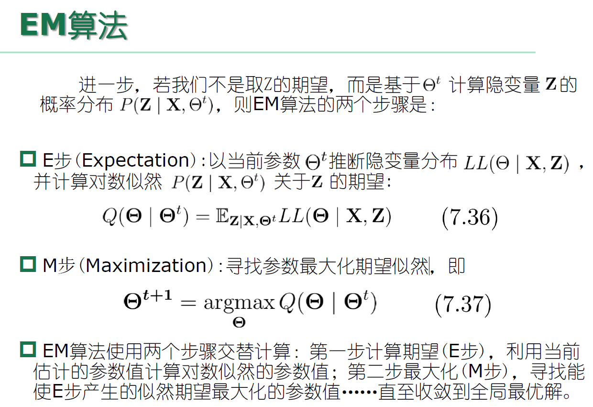

## EM算法举例
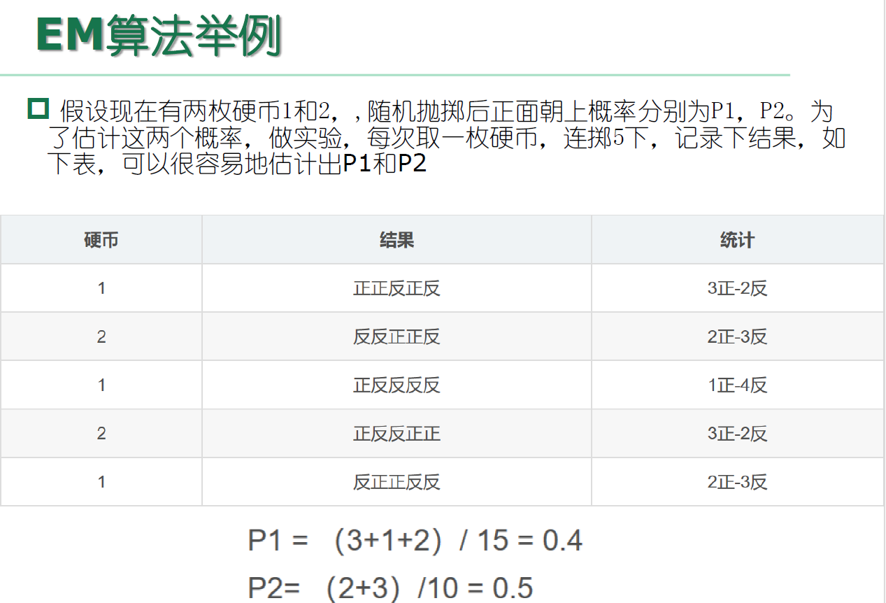
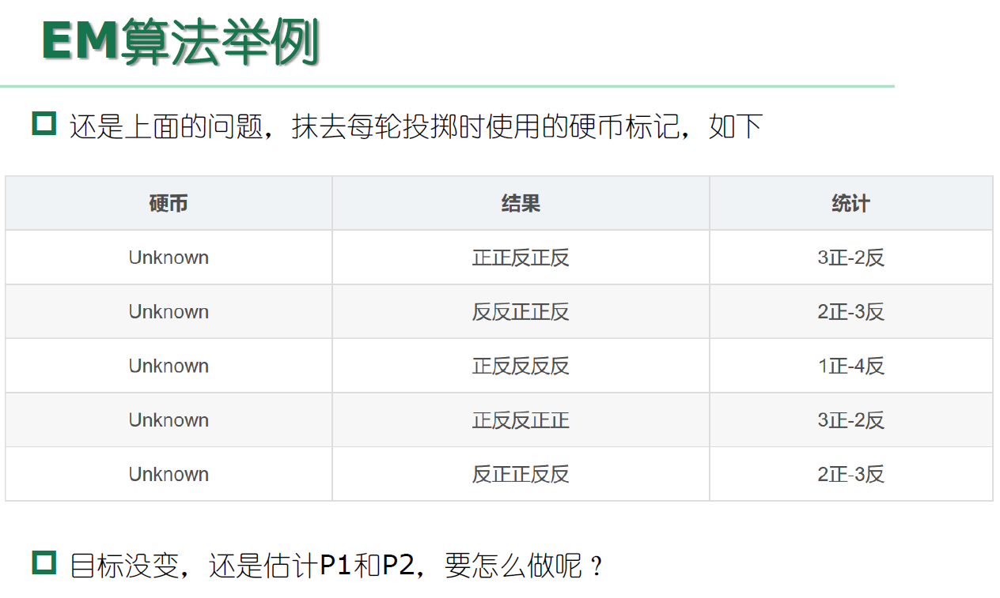

  1. 显然此时多了一个隐变量z，可以把它认为是一个5维的向量（z1,z2,z3,z4,z5)，代表每次投掷时所使用的硬币，比如z1，就代表第一轮投掷时使用的硬币是1还是2。但是，这个变量z不知道，就无法去估计P1和P2，所以，必须先估计出z，然后才能进一步估计P1和P2。
  
  2. 但要估计z，又得知道P1和P2，这样才能用最大似然概率法则去估计z，这不是鸡生蛋和蛋生鸡的问题吗，如何破？
  
  3. 答案就是先随机初始化一个P1和P2，用它来估计z，然后基于z，还是按照最大似然概率法则去估计新的P1和P2。
   
  4. 如果新的P1和P2和初始化的P1和P2一样，请问这说明了什么？这说明初始化的P1和P2是一个相当靠谱的估计！ 
  
  5. 就是说，初始化的P1和P2，按照最大似然概率就可以估计出z，然后基于z，按照最大似然概率可以反过来估计出P1和P2，当与初始化的P1和P2一样时，说明是P1和P2很有可能就是真实的值。这里面包含了两个交互的最大似然估计。
  
  6. 如果新估计出来的P1和P2和初始化的值差别很大，怎么办呢？就是继续用新的P1和P2迭代，直至收敛。
  
  7. 不妨先随便给P1和P2赋一个值，比如：P1 = 0.2 和 P2 = 0.7  
  
  8. 然后，看看第一轮抛掷最可能是哪个硬币。如果是硬币1，得出3正2反的概率为$0.2*0.2*0.2*0.8*0.8 = 0.00512$。如果是硬币2，得出3正2反的概率为$0.7*0.7*0.7*0.3*0.3=0.03087$。然后依次求出其他4轮中的相应概率。做成表格如下：

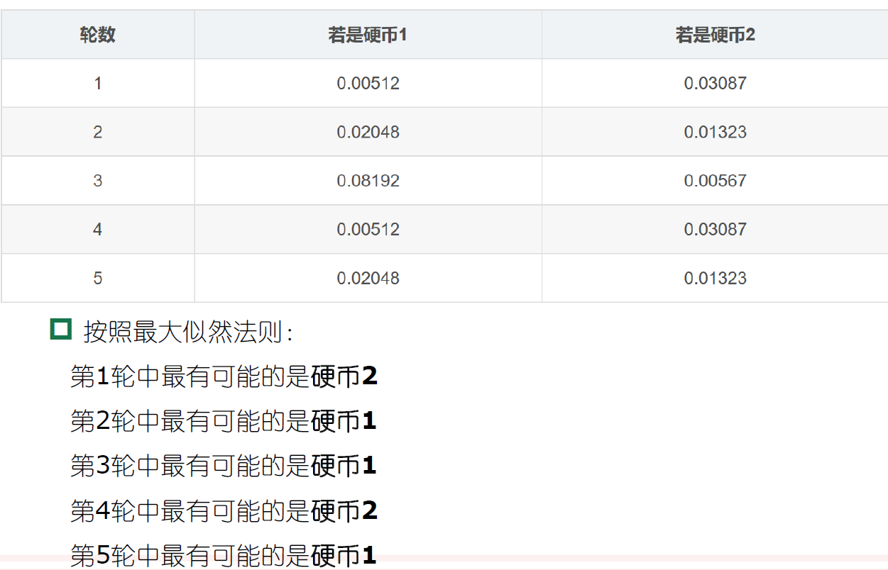
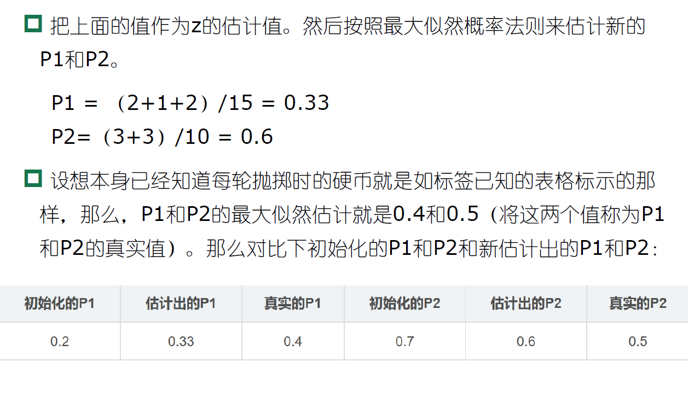
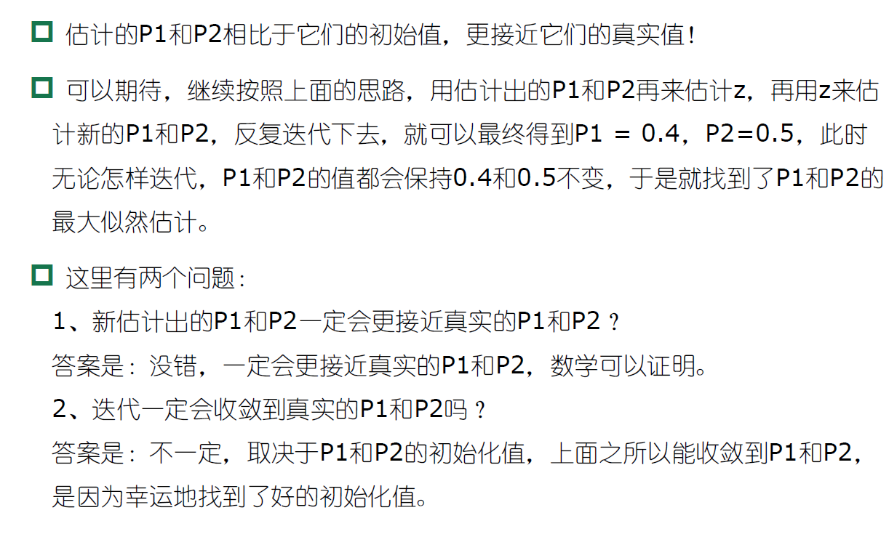

