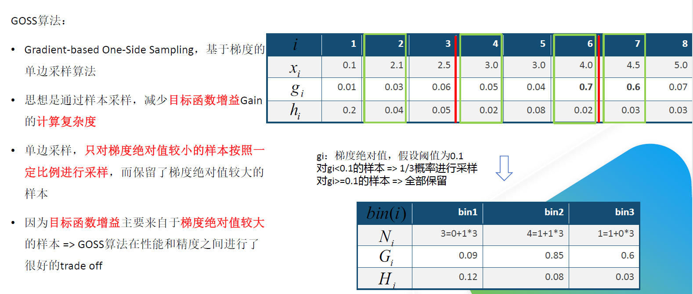

# 集成学习
这一章只放我认为重要的，系统的东西请看西瓜书.

集成学习主要的框架有，Bagging，Boosting 和 Stacking 。其中Bagging和Boosting为同质集成，而Stacking 为异质集成 。
> **同质集成**：个体学习器称为“基学习器”（base learner），对应的学习算法为“基学习算法”（base learning algorithm）。
> 
> **异质集成**：个体学习器称为“组件学习器”（component learner）或直称为“个体学习器”

## Bagging 两个阶段
>1. Bootstrap sampling 采样
>2. 模型融合（投票/平均）
>  
>

## Stacking
>• 不需要对训练集进行采样
>
>• 训练元模型进行融合
>
>• 元模型可以是一个，也多层多个
## 两类boosting算法
> AdaBoosting
> 
> • 分错的数据样本来识别问题
>
> • 通过调整分错的数据样本权重来改进模型

> Gradient Boosting
>
> • 负梯度来识别问题
>
> • 通过计算负梯度来改进模型

# 为什么说bagging降低方差，而boosting降低偏差？
## bagging与方差
设单模型的期望为$μ$，则Bagging的期望预测为

$$
    E(\frac{1}{n}\sum_{i=1}^{n}X_i)=\frac{1}{n}E(\sum_{i=1}^nX_i)=E(X_i)\approx \mu
$$
说明Bagging整体模型的期望近似于单模型的期望，这意味整体模型的偏差也与单模型的偏差近似，所以Bagging通常选用偏差低的强学习器。

Bagging的抽样是有放回抽样，这样数据集之间会有重复的样本，因而违反了独立性假设。在这种情况下设单模型之间具有相关系数 $0<ρ<1$，则模型均值的方差为：
$$
    Var(\frac{1}{n}\sum_{i=1}^{n}X_i)=\frac{\sigma^2}{n}+\frac{n-1}{n}\rho\sigma^2
$$
上式中随着n增大，第一项趋于0，第二项趋于$ρσ^2$，所以Bagging能够降低整体方差。而Bagging的拓展算法 —— 随机森林，则通过在树内部结点的分裂过程中，随机选取固定数量的特征纳入分裂的候选项，这样就进一步降低了单模型之间的相关性，总体模型的方差也比Bagging更低。

参考：https://www.cnblogs.com/massquantity/p/9029611.html

## boosting与偏差
>
>• 计算弱分类器的错误和残差
>
>• 作为下一个分类器的输入
>
>• 不断减小损失函数 ,偏差下降

>• 串行--各子模型之间是强相关的
>
>• 子模型之和并不能显著降低方差

# 随机森林

随机森林是 Bagging 框架下的一种算法，它随机采样方法，对样本和属性都进行。

1. 对样本进行有放回的采样, bootstrap采样, 即从m样本中有放回得抽取m个样本.
2. 对样本的属性进行随机抽样, 一般k = log2d.
3. 根据抽样的结果训练多颗决策树
4. 然后对决策树的输出进行融合
   
> **随机森林的优点**
> 
> 特征和数据的随机抽样:
> 
> • 可以处理高维数据
> 
> • 对缺失值鲁棒性较好
> 
> • 不容易过拟合
> 
> • 平衡因数据不导致的误差
> 
> • 判断不同特征之间的相互影响
> 
> 树模型的特征:
> 
> • 判断特征的重要程度
> 
> 算法结构:
> 
> • 可并行训练
> 
> • 结构简单，易实现
> 
> **随机森林的缺点**
> 
>  某些噪音较大的分类或回归问题上会过拟合
> 
>  取值划分较多的属性会对随机森林产生更大影响

# GDBT
## GBDT回归树基本模版
输入：训练数据集$T=\left \{ (x{_{1},y{_{1}}}),(x{_{2}},y{_{2}}),...,(x{_{N}},y{_{N}}) \right \}$，损失函数为$L(y,f(x))$

输出：回归树$F(x)$

（1）初始化：（估计使损失函数极小化的常数值，它是只有一个根节点的树，一般平方损失函数为节点的均值，而绝对损失函数为节点样本的中位数）
$$
    f_0(x) = argmin_c\sum_{i=1}^NL(y_i,c)
$$

（2）对$m=1,2,...,M$（$M$表示迭代次数，即生成的弱学习器个数）：

（2.1）对样本 $i=1,2,...N$，计算损失函数的负梯度在当前模型的值将它作为残差的估计，对于平方损失函数为，它就是通常所说的残差；而对于一般损失函数，它就是残差的近似值（伪残差）：
$$
                        r{_{mi}}=-[\frac{\partial L(y{_{i}},f(x{_{i}}))}{\partial f((x{_{i}}))}]_{f(x)=f{_{m-1}}(x)}
$$
（2.2）对$\left \{ (x{_{1}},r{_{m1}}),..., (x{_{N}},r{_{mN}})\right \}$拟合一个回归树，得到第$m$棵树的叶节点区域$R{_{mj}}，j=1,2,...,J$（$J$表示每棵树的叶节点个数）

（2.3）对$j=1,2,...,J$，利用线性搜索，估计叶节点区域的值，使损失函数最小化，计算
$$
                        c{_{mj}}=arg\underset{c}{min}\sum_{x{_{i}}\in R{_{mj}}}L(y{_{i}},f{_{m-1}}(x{_{i}}+c)))
$$
（2.4）更新
$$
                        f{_{m}}(x)=f{_{m-1}}(x)+\sum_{J}^{j=1}c{_{mj}}I(x\in R{_{mj}})
$$
（3）得到最终的回归树
$$
                               F(x)=\sum_{m=1}^{M}\sum_{j=1}^{J}c{_{mj}}I(x\in R{_{mj}})
$$

## GBDT的常用损失函数

### 回归问题

### 分类问题
交叉熵损失函数参考：https://zhuanlan.zhihu.com/p/35709485

## 为什么 GBDT 不适合使用高维 稀疏特征 ?

高维稀疏特征会使树模型的训练变得极为 低效 ，且容易 过拟合。

 树模型训练过程是一个贪婪选择特征 的算法，要从候选特征集合中择一个使分裂后收益函数增益最大的特征来分裂。按照高维特征做分裂时，计算量会非常大，训练会非常慢。

 同时，按高维稀疏特征分裂得到的子树泛化性也比较弱 ，由于只包含了对应位置值的样本，样本稀疏时也很容易过拟合。
## GBDT 算法的优缺点？
优点 ：

• 预测计算可并行 ，速度快

• 稠密数据，泛化能力和表现好

• 决策树做弱分类器

    o解释性和鲁棒性好

    o自动发现特征间的 高阶关系

    o不需要对数据做特殊预处理

缺点 ：

• 高维稀疏数据集表现不佳

• 树与之间的训练过程需要串行计算.

# XGboost
GBDT是**机器学习算法** ，XGBoost 是该算法的**工程实现**

## XGboost的目标函数

XGBoost的目标函数：
$$    
    Obj^t = \sum_{i=1}^nl(y_i,\hat{y}_i^{t-1}+f_t(x_i))+\Omega(f_t)+constant
$$
对目标函数改进，行二阶泰勒展开：
$$
    f(x+\Delta x)\approx f(x)+f'(x) \Delta x+\frac{1}{2}f''(x) \Delta x^2
$$
把损失函数二阶泰勒展开：

$l(y_i,\hat{y}_i^{t-1}+f_t(x_i)) \approx l(y_i,\hat{y}_i^{t-1})+ \partial_{\hat{y}_i^{t-1}}l(y_i,\hat{y}_i^{t-1}+f_t(x_i))f_t(x_i)+\frac{1}{2}\partial^2_{\hat{y}_i^{t-1}}l(y_i,\hat{y}_i^{t-1}+f_t(x_i))f^2_t(x_i)$

并令：

$g_i=\partial_{\hat{y}_i^{t-1}}l(y_i,\hat{y}_i^{t-1})$

$h_i=\partial^2_{\hat{y}_i^{t-1}}l(y_i,\hat{y}_i^{t-1})$

则有：
$$
Obj^t\approx \sum_{i=1}^n\left[l(y_i,\hat{y}_i^{t-1})+g_if_t(x_i)+\frac{1}{2}h_if^2_t(x_i)\right ]+\Omega(f_t)+constant
$$

考虑实际中$l(y_i,\hat{y}_i^{t-1})$为可以计算的常数项，则有：
$$
Obj^t\approx \sum_{i=1}^n\left[g_if_t(x_i)+\frac{1}{2}h_if^2_t(x_i)\right]+\Omega(f_t)+constant
$$

## XGBoost 节点分裂

## XGBoost和GBDT有什么不同？
1. GBDT是机器学习算法，XGBoost 是该算法的工程实现。
2. 在使用 CART 作为基础分类器时，XGBoost 显示地加入了正则项 来控制模型的复杂度，有利于防止过拟合，从而提高模型的泛化能力。
3. GBDT 在模型训练时只使用了损失函数的一阶导数信息， XGBoost对代价函数记性二阶泰克展开，可以同时使用一阶和二导数。
4. 传统的GBDT采用CART作为基础分类器，XGBoost支持多种类型的基础分器.
5. 传统的GBDT在每轮迭代时使用全部的数据，XGBoost则支持对数据进行采样.
6. 传统的GBDT没有涉及对缺失值进行处理，XGBoost能够自动学习出缺失值的处理策略。
7. XGBoost还支持并行计算(分裂节点时考虑同时算$G_i$和$H_i$，树还是串行生产)，XGBoost的并行是基于特征计算，将列排序后以 block 的形式存储在内中，在后面的迭代中重复使用这个结构。
## XGBoost 为什么可以并行训练？
注意 xgboost 的并行不是 tree 粒度的并行， xgboost 也是一次迭代完才能进行下的 （第 t次迭代的价函数里包含了前面 t-1次迭代的预测值）。

• xgboost 的并行是在特征粒度上的。我们知道，决策树学习最耗时一个步骤就是对特征的值进行排序（因为要确定最佳分割点）， xgboost 在训练之前，预先对数据进行了排 序，然后保存为 block 结构，后面的迭代中重复地使用这个 大减小计算量。block 结构也使得并行成为了可能，在进节点的分裂时需要计算每个特征增益最 终选增益最大的那个特征去做分裂，那么各个特征的增益计算就 可以在多线程进行。

• 树节点在进行分裂时，我们需要计算每个特征的割对应增益即用贪心法枚举所有可能的分割点。当数据无法一次载入内存或者在布式情况下，贪心算效率就会变得很低，所以 xgboost 还提出了一种可并行的直方图算法，用于高效地生成候选的分割点 。

## XGBoost 防止过拟合的方法？
1. 数据
    
     样本采样-在生成每颗树的时候可以对数据进行随机采样。

     特征采样-而且还可以在生成每棵树的时候，一层子节点及在每次做节点分裂的时候，选择是否对特征进行采样。

2. 模型

     限制树的深度，树的深度越模型复杂。

     设置叶子节点上样本的最小数量 ，这个值越 宽松（比较小）则树的枝叶多模型复杂；相反如果这个值越大，则树的枝叶少模型简单。太小会导致过拟合，太大会导致欠。

3. 正则化

     **L1 和 L2 正则化损失项的权重**

     叶子节点数量惩罚项的权重值

## XGBoost 为什么这快？
1) 同时采用了损失函数的一阶导和二阶导数，使得目标函数收敛更快。
2) 在进行节点分类时采用的贪心算法和直方图算法，大加速了节点分裂的计算过程。
3) 工程优化，使得模型训练时可进行并行计算

# lightGBM
参考官方链接：https://lightgbm.readthedocs.io/en/latest/Features.html#references

1. 2017 年经微软推出，XGBoost的升级版
2. Kaggle竞赛使用最多的模型之一,tabular 数据必备.
3. Light -> 在大规模数据集上运行效率更高
4. GBM -> Gradient Boosting Machine

## Motivation

## lightGBM vs XGBoost

## lightGBM针对XGBoost的优化
XGBoost模型复杂度：
> 模型复杂度 = 树的棵数 X 每棵树的叶子数量 X 每片叶子生成复杂度
>
> 每片叶子生成复杂度 = 特征数量 X 候选分裂点数量 X 样本的数量

针对XGBoost的优化(主要针对叶子生产复杂度的三项)：

1. Histogram算法，**直方图算法** -> 减少候选**分裂点**数量
2. GOSS 算法，基于梯度的 **单边采样** 算法 -> 减少 **样本** 的数量
3. EFB 算法，互斥 **特征捆绑** 算法 -> 减少 **特征** 的数量

lightGBM = XGBoost + Histogram + GOSS + EFB

## 直方图

## GOSS

## EFB

# CatBoost

