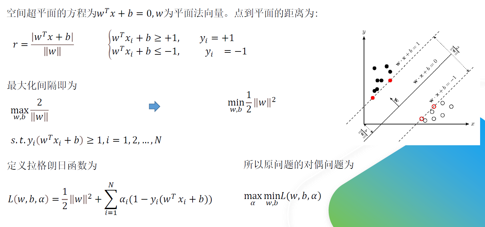
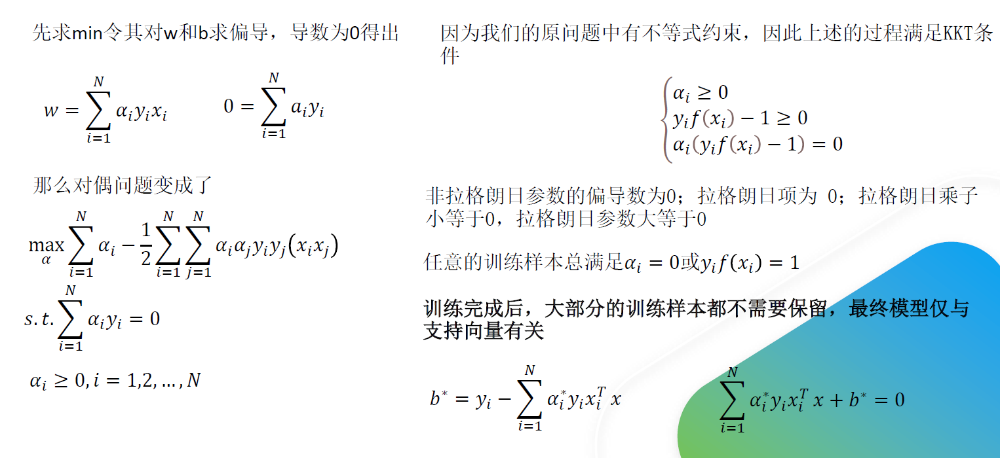
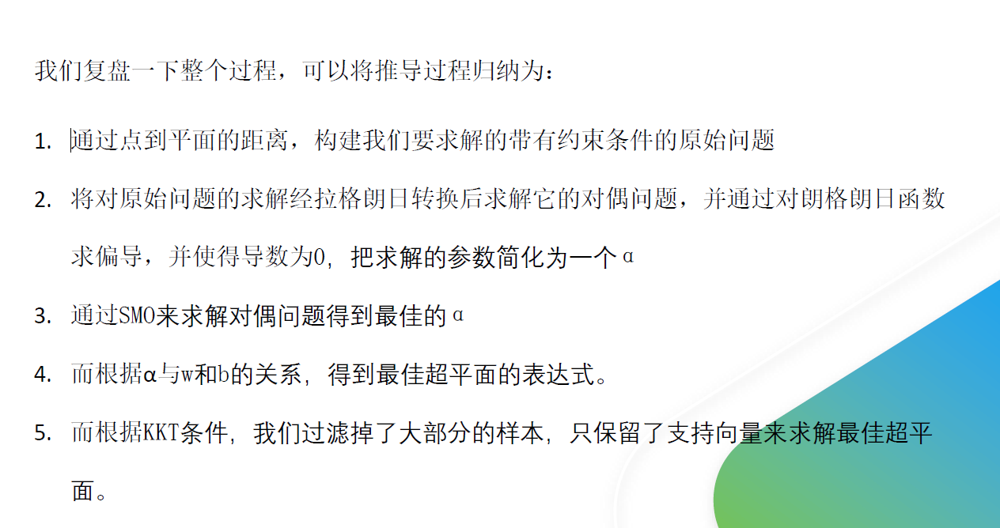
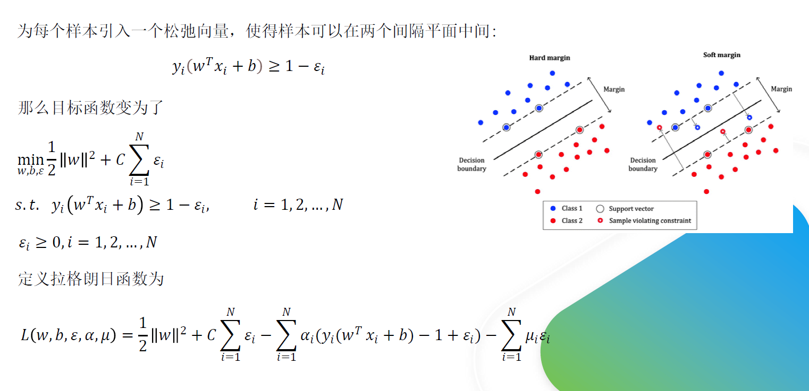
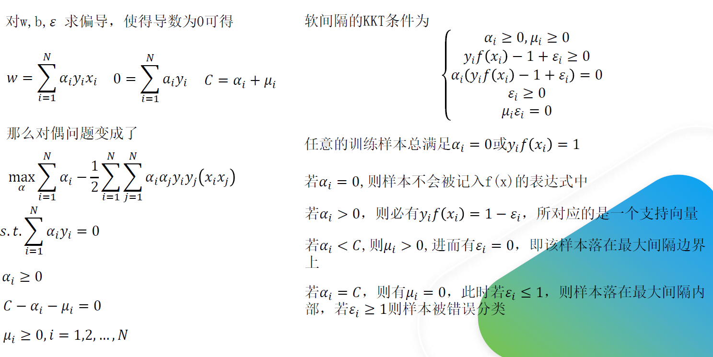
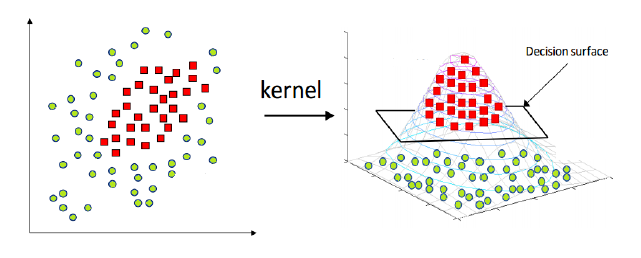
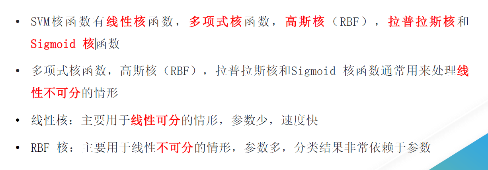

# SVM
参考链接：
详细的一些推导过程.
1. https://zhuanlan.zhihu.com/p/24638007
2. https://zhuanlan.zhihu.com/p/29865057

SVM 是一种**二分类**模型。它的基本模型是在特征空间中寻找间隔最大化的分离超平面的**线性分类器**。

   1. 当样本**线性可分**时，可以通过**硬间隔**最大化，学习一个线性分类器，即线性可分的支持向量机;
   2. 当训练数据**近似线性可分**时，引入**松弛变量**，通过**软间隔最大化**，学习一个线性分类器，即线性支持向量机；
   3. 当训练数据线性不可分时，通过使用**核技巧**和**软间隔**最大化，学习非线性支持向量机.

SVM采取间隔（margin）最大化使得分离超平面**唯一**，这样的结果是鲁棒的且泛化性强.

# 硬间隔推导

# 软间隔推导

## SVM 的超参数C如何调节
由于C可以看做与正则化参数λ作用相反 （C作用于损失项上，而λ作用于正则化项 上，见软间隔推导过程），则对于C的调节：

1. 低偏差，高方差 即遇到了 过拟合 时； 减少C值。
2. 高偏差，低方差 即遇到了 欠拟合 时： 增大C值。

$$
    \min_{w,b,\epsilon}\frac{1}{2}||w||^2+C\sum_{i=1}^N\epsilon_i
$$

# SVM核函数
当样本在原始空间**线性不可分**时，可将样本从原始空间映射到一个**更高维的特征空间**，使得这个样本在这个特征空间内线性可分。

核函数的定义：在特征空间的**内积**等于他们在原始样本空间中通过核函数$\kappa$的计算结果.

$$
    \kappa(x,y)=<\phi(x), \phi(y)> = \phi(x)^T\phi(y)
$$

核函数的好处:
1. 一方面数据变成了高维空间中**线性可分**的数据
2. 另一方面**不需要求解**具体的**映射函数的内积**，只需要给定具体的核函数即可，这样使得**求解难度大大降低**
   
## SVM核函数区别

# SVM优缺点
优点：
   1. 可以有效解决 高维特征的分类和回归问题
   2. 无需依赖全体样本， 只依赖**支持向量**
   3. 有大量的**核技巧**可以使用，从而应对 **线性不可分**问题
   4. **样本量中等偏小** 照样有较好的 效果
   5. 泛化能力较强

缺点：
   1. 常规 SVM 只支持二分类
   2. SVM 在样本巨大且使用核函数时计算量很大
   3. 非线性可分数据的 **核函数选择** 依旧没有统一标准
   4. SVM 对**缺失** 和**噪声** 数据敏感
   5. 特征的多样性限制了 SVM 的使用 ，SVM 更适合去 处理“**同性质**”的特征
