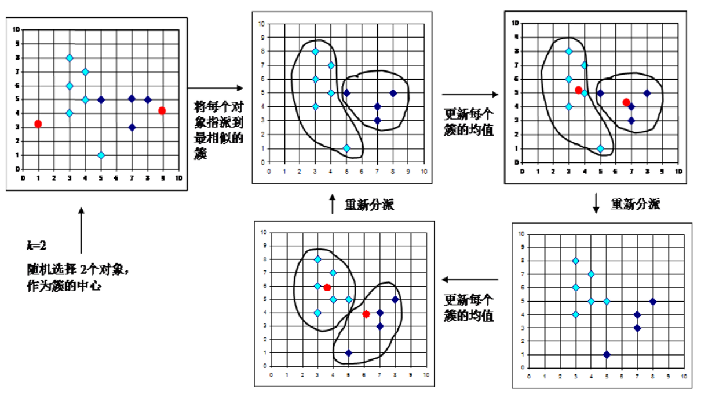
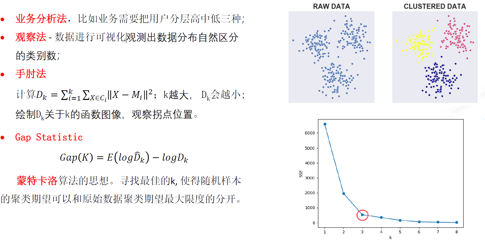

# K-means

## 流程
1. 随机初始化 k个中心点 
2. 计算所有样本到中心点的距离
3. 比较每个样本到k个中心点的距离, 将样本分类到距离最近的类别中
4. k个类别组成的样本点重新计算中心(如在每一个方向上计算均值)
5. 重复2-4，直到中心点不再变化
   

## K-meas++

如何选择K?

思想: 

    初始化的聚类中心点之间距离尽可能地远 (对初始化进行优化)

流程：
1. 随机初始化一个中心
2. 对于每个样本$x$，计算距离 它最近的中心点欧式$D(x)$，
每个样本被选为 中心点的概率$\frac{𝐷(𝑥_𝑖)^2}{\sum_{i=1}^{n}𝐷(𝑥_𝑖)^2}$。按照轮盘法选择出下一个中心点；
3. 重复步骤 2，直到选出所有的中心点。

## kmeans 对异常值是否敏感？
Kmeans 对异常值较为敏感，因一个集合内元素的 **均值易受** 到一个 **极大值** 的影响。因为有了一个异常值这元素集合的中心点 严重偏离了大多数点所在的位置区域；因此有异常值影响情况下，均值所计算出来的中心位置并不能反应真实的类别中心.

## 超参数 k 如何选择？

手肘法：样本点减去中心点。 参考：https://www.jianshu.com/p/335b376174d4

## Kmeans 算法的优缺点
优点：
   1. 容易理解，聚类效果不错；
   2. 处理大数据集的时候，该算法可以保证较好的**伸缩性** (即稍作改进可以处理大数据集)；
   3. 当数据簇近似 **高斯分布** 的时候，效果非常不错；
   4. 算法复杂度低 – 时间复杂度为 **O(n*k*t)** 其 中n为样本数， k为类别数， t为迭代次数； 而且通常来说 k和t 相对于 n 来说很小 。

缺点:
 1. 受人为设定的 K 值影响较大；
 2. 对**初始的类别中心敏感** ，不同选取方式会得 到不同结果；
 3. 对**异常值敏感**；
 4. 样本只能归为一类， **不适合多标签分类** 任务；
 5. 不适合 **太离散** 的分类、样本 **类别不平衡** 的分类以及同样本分布呈 **非凸**形状的分类.

