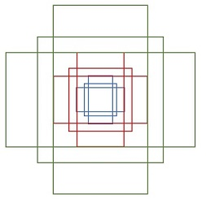

# Faster RCNN 
参考：https://zhuanlan.zhihu.com/p/31426458

Faster RCNN其实可以分为4个主要内容：
1. Conv layers。作为一种CNN网络目标检测方法，Faster RCNN首先使用一组基础的conv+relu+pooling层提取image的feature maps。该feature maps被共享用于后续RPN层和全连接层。
2. Region Proposal Networks。RPN网络用于生成region proposals。该层通过softmax判断anchors属于positive或者negative，再利用bounding box regression修正anchors获得精确的proposals。
3. Roi Pooling。该层收集输入的feature maps和proposals，综合这些信息后提取proposal feature maps，送入后续全连接层判定目标类别。
4. Classification。利用proposal feature maps计算proposal的类别，同时再次bounding box regression获得检测框最终的精确位置。

## Region Proposal Networks(RPN)
经典的检测方法生成检测框都非常耗时，如OpenCV adaboost使用滑动窗口+图像金字塔生成检测框；或如R-CNN使用SS(Selective Search)方法生成检测框。而Faster RCNN则抛弃了传统的滑动窗口和SS方法，直接使用RPN生成检测框，这也是Faster R-CNN的巨大优势，能极大提升检测框的生成速度。

上图4展示了RPN网络的具体结构。可以看到RPN网络实际分为2条线:
1. 上面一条通过softmax分类anchors获得positive和negative分类，
2. 下面一条用于计算对于anchors的bounding box regression偏移量，以获得精确的proposal。
3. 而最后的Proposal层则负责综合positive anchors和对应bounding box regression偏移量获取proposals，同时剔除太小和超出边界的proposals。其实整个网络到了Proposal Layer这里，就完成了相当于目标定位的功能。
   
## anchors 
提到RPN网络，就不能不说anchors。所谓anchors，实际上就是一组由rpn/generate_anchors.py生成的矩形。
其中每行的4个值 $(x_1, y_1, x_2, y_2)$ 表矩形左上和右下角点坐标。9个矩形共有3种形状，长宽比为大约为 $width:height\in \left\{1:1, 1:2, 2:1\right\}$ 三种，如下图。实际上通过anchors就引入了检测中常用到的多尺度方法。

那么这9个anchors是做什么的呢？借用Faster RCNN论文中的原图，如图7，遍历Conv layers计算获得的feature maps，为每一个点都配备这9种anchors作为初始的检测框。这样做获得检测框很不准确，不用担心，后面还有2次bounding box regression可以修正检测框位置。

其实RPN最终就是在原图尺度上，设置了密密麻麻的候选Anchor。然后用cnn去判断哪些Anchor是里面有目标的positive anchor，哪些是没目标的negative anchor。所以，仅仅是个二分类而已！

## Proposal Layer

Proposal Layer负责综合所有 bounding box regression 后的变换量和positive anchors，计算出精准的proposal，送入后续RoI Pooling Layer。

RPN网络结构就介绍到这里，总结起来就是：

生成anchors -> softmax分类器提取positvie anchors -> bbox reg回归positive anchors -> Proposal Layer生成proposals

## RoI pooling
RoI Pooling层则负责收集proposal，并计算出proposal feature maps，送入后续网络。从图2中可以看到Rol pooling层有2个输入：

1. 原始的feature maps
2. RPN输出的proposal boxes（大小各不相同）

### RoI Pooling layer forward过程
1. 由于proposal是对应MxN尺度的，所以首先使用spatial_scale参数将其映射回(M/16)x(N/16)大小的feature map尺度；
2. 再将每个proposal对应的feature map区域水平分为 $pooled_w \times pooled_h$ 的网格；
3. 对网格的每一份都进行max pooling处理。

这样处理后，即使大小不同的proposal输出结果都是 $pooled_w \times pooled_h$ 固定大小，实现了固定长度输出。

### ROI pooling ROI pooling 的不足是什么?

### ROI Align 的具体做法是什么

## Classification
Classification部分利用已经获得的proposal feature maps，通过full connect层与softmax计算每个proposal具体属于那个类别（如人，车，电视等），输出cls_prob概率向量；同时再次利用bounding box regression获得每个proposal的位置偏移量bbox_pred，用于回归更加精确的目标检测框。

从RoI Pooling获取到7x7=49大小的proposal feature maps后，送入后续网络，可以看到做了如下2件事：

1. 通过全连接和softmax对proposals进行分类，这实际上已经是识别的范畴了
2. 再次对proposals进行bounding box regression，获取更高精度的rect box

