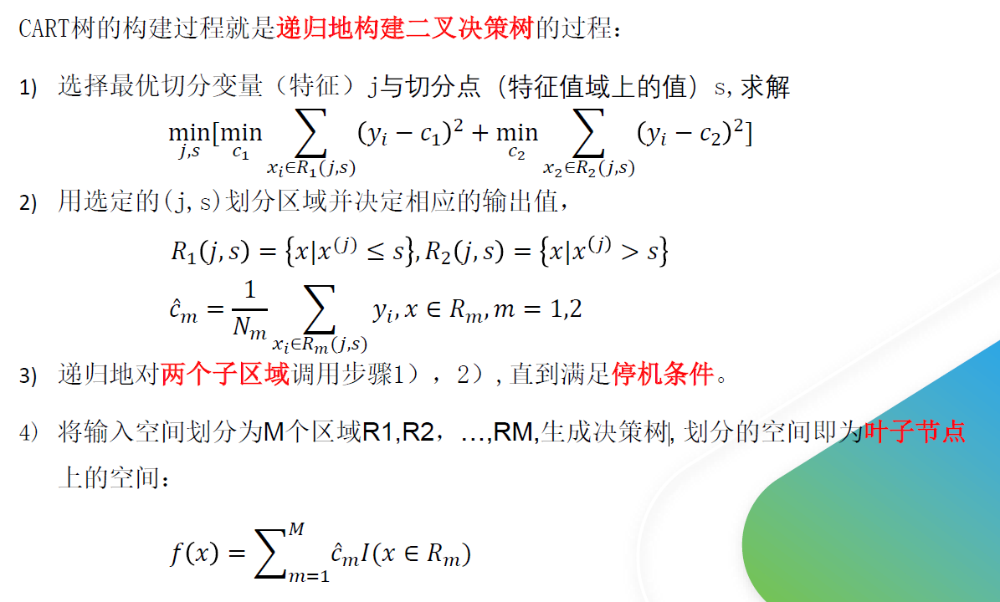

# 机器学习基础

##  特征工程

### 1. One-hot编码
    处理类别特征，采用哑变量(dummy varibles)对每个类别变量进行编码, 每个类别应该是平衡的，如果不用one-hot会产生距离长短问题,类别差异问题.
### 2. 归一化
两种方法min-max和z-score

1. 为什么线性模型(包括：线性回归，逻辑回归,支持向量机，神经网络)，梯度下降的模型需要归一化，而树模型(节点分裂的根据是信息增益等指标),贝叶斯模型不需要.

2. 梯度下降不归一化，每个维度下降幅度不规整，会呈一个椭圆形。归一化后会使得梯度下降更快，更容易收敛.

### 3. 特征组合

    组合特征有时候会使模型变得复杂，这个时候可以考虑做特征的embeding, 即将x_i, x_j (分别m,n维特征) 分别用长度为K的低维向量表示(k << m, k<<n)，那么学习的参数规模变成为 m * k + n* k + k * k, 而不是m * n.

### 4. 欧式距离，曼哈顿距离，余弦相似度.
1. 欧式距离, 表示两个空间点的直线距离：
$$
   d=(\sum_{k=1}^{n}|a_k-b_k|^2)^{1/2}
$$
2. 曼哈顿距离，所有维度距离绝对之和，长用于地图导航等：
$$
    d = \sum_{k=1}^{n}|a_k-b_k|
$$
欧式距离在各个维度上有自动的计算了一个“权重贡献”，这使得每个维度的上的距离动态发生变化，而曼哈顿距离每个维度的权重贡献是一致的.

3. A和B两个向量，余弦相似度:
$$
    cos(A,B) = \frac{A+B}{||A||_2+||B||_2}
$$
$$

    ||A-B||_2 = \sqrt{2(1-cos(A,B))}
$$
余弦相似度关注的角度问题，不是距离问题,是两个向量的的相对差异而不是绝对差异，其取值在[-1,1]之间. 广泛应用于文本，图像和视频领域.

## 模型评估

### 1. 偏差与方差
过拟合是指模型对于训练数据拟合呈过当的情况，反映到评估指标上，就是模型在训练集上的表现好，但是在测试集和新数据上的表现较差。欠拟合指的是模型在训练和预测时表现都不好。用模型在数据上的偏差和方差指标来表示就是。欠拟合时候，偏差和方差都比较大，而过拟合时，偏差较小但方差较大

降低过拟合的方法：
1. 特征：
   
   1. 减少不必要特征，根据重要特征删除稀疏特征
   2. 数据增广，使数据增加
2. 模型复杂度：
降低模型复杂度， 比如神经网络：减少层数。 树模型：降低深度，剪枝.
3.  正则化
4. 采用多模型集成，如bagging, stacking. 
5. 模型训练：早停策略.

### 2. L1和L2正则先验分别服从Laplace分布和Gaussian分布
    具体的推导过程与逻辑回归的似然函数类似.

### 3. 数据不平衡
1. 采样， 过采样或欠采样
2. 设计代价不平衡函数

### 4. 性能评价指标
1. 回归问题：可以分为点对点(MSE)，带归一化，点对面（R系数）
2. 分类问题：混淆矩阵在内的指标, acc, precision, recall, F1-score, ROC (纵坐标TPR,横坐标FPR(预测为正实际为负占负样本比例)), AUC.
    
## 线性回归与逻辑回归
### 根据似然函数进行交叉熵损失函数的推导：

### 多标签多分类问题
1. 当K个类别不是互斥的时候，即每次对样本进行分类时，不需要考虑它是不是还可能是别的类别;那么我们可以为**每个类别**建立一个逻辑回归模型。用它来判断样本是否属于当前类别
2. 当K个类别是互斥的时候，即y=i的时候意味着y不能取其他的值，这种情况下 Softmax回归更合适一些。 Softmax回归是直接对逻辑回归在多分类的推广，相应的模型也可以叫做多元逻辑回归（ Multinomial Logistic Regression）。模型通过 softmax函数来对概率建模，具体形式如下：
$$
    \hat{y_i} = \frac{e^{a_i}}{\sum_{j=1}^Ke^{a_j}}
$$
Loss function:
$$
L(\hat{y},y) = - \sum_{i=1}^K y_ilog\hat{y_i}
$$

## 朴素贝叶斯
### 1. 工作流程
1. 数据准备，选好的特征删掉相关性高的特征以获得数据
2. 分类器训练
$$
P(c|x) = \frac{P(c)P(x|c)}{P(x)} =\frac{P(c)}{P(x)}\prod_{i=1}^dP(x_i|c)
\\
h(x) = \argmax_{c\in y}P(c)\prod_{i=1}^dP(x_i|c)
$$
3. 根据h(x)进行预测.

d是属性的数目

训练的是基于类别的先验分布和基于熟悉的后验分布,除了**拉普拉斯修**正外，没有可调节的参数.

异常值不敏感：统计结果，偶尔值影响不大

# 集成学习

## 1. bagging, stacking 和 boosting
1. bagging: 利用bootstrap采样并行的训练一批同类的模型然后集成. bootstrap是有放回采样.
2. stacking： 先并行训练n个基模型，然后训练一个元模型将各个基模型的输出进行集成.
3. boosting: 串行的训练一系列前后依赖的模型，后一个模型需要前一个模型的进行修正. boosting算法分两类，adaboost和gradient boosting. 
    
    1. adaboost利用分错的样本数据来识别问题，通过调整分错样本的权重来改进模型.
    2. gradient boosting通过负梯度来识别问题，通过计算负梯度来改进模型.

### bagging减少方差，boosting减少偏差
$$
    E(\frac{1}{n}\sum_{i=1}^{n}X_i)=\frac{1}{n}E(\sum_{i=1}^nX_i)=E(X_i)\approx \mu
$$
$$
    Var(\frac{1}{n}\sum_{i=1}^{n}X_i)=\frac{\sigma^2}{n}+\frac{n-1}{n}\rho\sigma^2
$$
## 2. 随机森林
1. 从N个样本中根据bootstrap有放回的采样N个样本
2. 从M个特征的特征集中获取m个特征的子集进行节点分裂.
3. 集成.

### 优缺点:
1. 两个随机性上：a. 处理高维； b. 泛化性强; c. 异常值不敏感
2. 树的特征： 判断属性权重
3. 并行计算
4. 缺点：对于一些不同取值的特征，取值划分较多的特征影响更大，树的问题.

### 为什么不用全部m的数据训练
    基模型都是树是同质的，数据集又是高度相关的，这样训练出来没有泛化性强的特点.

## 3. GBDT
1. 通过最小化损失函数初始化一个归还树
2. 计算所有样本在树的负梯度
3. 根据负梯度和样本真实值训练一个新的回归树
4. 通过累加更新之前的树
5. 重复2-5最后输出模型.

### 损失函数：
分类可以参考指数函数：$L = e^{-y\hat{y}}$

Huber Loss结合了MAE 和 MSE.在x=0处可导.

### 为什么GBDT不适合使用高维稀疏特征？
高维稀疏的ID类特征会使树模型的训练变得**极为低效，且容易过拟合**
1. 树模型训练过程是一个贪婪选择特征的算法，要从候选特征集合中选择一个使
分裂后收益函数增益最大的特征来分裂。按照高维的ID特征做分裂时，子树数
量非常多，计算量会非常大，训练会非常慢
2. 同时，按ID分裂得到的子树的泛化性也比较弱，由于只包含了对应ID值的样
本，样本稀疏时也很容易过拟合。

## 4. XGBoost

### XGBoost和GBDT有什么不同？
1. GBDT是机器学习算法，XGBoost 是该算法的工程实现。
2. 在使用 CART 作为基础分类器时，XGBoost 显示地加入了正则项 来控制模型的复杂度，有利于防止过拟合，从而提高模型的泛化能力。
3. GBDT 在模型训练时只使用了损失函数的一阶导数信息， XGBoost对代价函数记性二阶泰克展开，可以同时使用一阶和二导数。
4. 传统的GBDT采用CART作为基础分类器，XGBoost支持多种类型的基础分器.
5. 传统的GBDT在每轮迭代时使用全部的数据，XGBoost则支持对数据进行采样.
6. 传统的GBDT没有涉及对缺失值进行处理，XGBoost能够自动学习出缺失值的处理策略。
7. XGBoost还支持并行计算(分裂节点时考虑同时算$G_i$和$H_i$，树还是串行生产)，XGBoost的并行是基于特征计算，将列排序后以 block 的形式存储在内中，在后面的迭代中重复使用这个结构。

## lightGBM
### lightGBM针对XGBoost的优化
XGBoost模型复杂度：
> 模型复杂度 = 树的棵数 X 每棵树的叶子数量 X 每片叶子生成复杂度
>
> 每片叶子生成复杂度 = 特征数量 X 候选分裂点数量 X 样本的数量

针对XGBoost的优化(主要针对叶子生产复杂度的三项)：

1. Histogram算法，**直方图算法** -> 减少候选**分裂点**数量
2. GOSS 算法，基于梯度的 **单边采样** 算法 -> 减少 **样本** 的数量
3. EFB 算法，互斥 **特征捆绑** 算法 -> 减少 **特征** 的数量

lightGBM = XGBoost + Histogram + GOSS + EFB

# 机器学习模型
## k-means
### 流程
1. 随机初始化 k个中心点 
2. 计算所有样本到中心点的距离
3. 比较每个样本到k个中心点的距离, 将样本分类到距离最近的类别中
4. k个类别组成的样本点重新计算中心(如在每一个方向上计算均值)
5. 重复2-4，直到中心点不再变化

### k-means++
中心点的初始化很重要

思想：初始化聚类中心点的之间距离尽可能地远。
流程：
1. 随机初始化一个中心点
2. 对于每个点算距离最近的中心点的距离$D(x)$， 每个样本被选为中心点的概率$P = \frac{D(x_i)^2}{\sum_nD(x_i)^2}$，然后根据轮盘选选出中心点
3. 重复2直到选完.

### 超参数K如何选?
手肘法
$$
D_k = \sum_{i=1}^{k}\sum_{x \in C}||x - M_i||
$$
根据K绘制图， 找到拐点.

### 优缺点

算法复杂度低： $O(nkt)$ 样本数n, 类别数k, 迭代次数t. 后两者都很小。

当数据解决高斯分布时，效果不错

异常值敏感，非凸样本的分类效果不好.

## SVM
### 1. 推导

### 2. 核函数

当样本在原始空间**线性不可分**时，可将样本从原始空间映射到一个**更高维的特征空间**，使得这个样本在这个特征空间内线性可分。

核函数的定义：在特征空间的**内积**等于他们在原始样本空间中通过核函数$\kappa$的计算结果.

$$
    \kappa(x,y)=<\phi(x), \phi(y)> = \phi(x)^T\phi(y)
$$

SVM核函数有线性核函数，多项式核函数，高斯核（RBF），拉普拉斯核和 Sigmoid
核函数。
1. 其中多项式核函数，高斯核（RBF），拉普拉斯核和 Sigmoid核函数通常
用来处理线性不可分的情形。
2. 而一般选择核函数时通常考虑线性核和高斯核，也就是线性核与RBF核。
3. 线性核: 主要用于线性可分的情形，参数少，速度快，对于般数据，分类效果已经很理想了。
4. RBF核:主要用于线性不可分的情形，参数多，分类结果非常依赖于参数。有很多人是通过训练数据的交叉验证来寻找合适的参数，不过这个过程比较耗时。

### 3. SVM对缺失数据敏感

### 4. SVM 的超参数C如何调节
由于C可以看做与正则化参数λ作用相反 （C作用于损失项上，而λ作用于正则化项 上，见软间隔推导过程），则对于C的调节：

1. 低偏差，高方差 即遇到了 过拟合 时； 减少C值。
2. 高偏差，低方差 即遇到了 欠拟合 时： 增大C值。

## 决策树
### 1. 简述决策树的构建过程
1. 构建根节点，将所有训练数据都放在根节点
2. 选择一个最优特征，按照这一特征将训练数据集分割成子集，使得各个子集在当前条件下获得最好的分类
3. 如果子集非空，或未达到停机条件，递归1，2步骤，直到所有训练数据子集都被正确分类或没有合适的特征为止

### 信息增益与基尼指数
信息增益
$$
g(D, A) = H(D) - H(D|A)
$$

$$
gini(D) = 1 - \sum_{i=1}^{|A|}p_k^2
\\
gini(D,A) = \sum_{v=1}^{|V|}\frac{|D^v|}{|D|}gini(D^v)
$$
### CART回归树

### 剪枝
预剪枝的主要方法有
1. 限制树的深度-当树到达一定深度的时候，停止树的生长
2. 限制叶子节点的数量
3. 规定叶子区域内最少的样本数，未达到最少样本数的叶子区域不做分
4. 计算每次分裂对测试集的准确度提升

后剪枝的核心思想是让算法生成一颗完全生长的决策树，然后最底层向上计算是否剪
枝。剪枝过程将子树删除，用一个叶子节点替代，该节点的类别同样按照多数投票的
原则进行判断。同样地，后剪枝也可以通过在测试集上的准确率进行判断，如果剪枝
过后准确率有所提升，则进行剪枝。相比于预剪枝，后剪枝方法通常可以得到泛化能
力更强的决策树，但时间开销会更大

# 深度学习基础

## BN

### BN的作用

BN（ Batch Normalization）的提出是为了解决 Internal Covariate Shift的问题，即当深度神经网络经过多层的计算，输入到每一层的数据分布发生了严重的改变，这种输入数据上的抖动和变化，使得网络参数难以学习，随着网络的加深模型更加难以收敛。Batch Normalization层的引入，使得每一层的输入数据都归一化到近似于均值为0方差为1的分布上，从而大大缓解了 **Internal Covariate Shift**的问题。此外，BN还给深度神经网络带来了以下好处

1. BN可以解决每一层数据不稳定的问题（**Internal Covariate Shift**）
2. BN可以解决梯度消失的问题
    
    a. 例如在 Sigmoid激活函数里面，当输入值非常大或者非常小的时候，梯度接近于0而将数据归一化到（0，1）之间，梯度可以很好地得到更新
3. 网络的训练速度加快
4. 引入BN层之后，使得激活函数的使用更加丰富和灵活。
5. 使得网络参数初始化和学习率的参数调节更加容易和灵活。

### BN的实现
注意BN是根据mini-batch对神经网络的隐藏层输出z进行标准化. 有两个参数进行学习. 在测试时通常取期望和方差的加权平均.

## 指数加权平均
指数加权平均的关键函数：
$$
    v_t = \beta v_{t-1}+(1-\beta)\theta
$$
偏差修正：

$$
    v_t = \frac{v_t}{1-\beta^t}
$$

# 计算机视觉

## 1. CNN的平移不变性
平移不变性（translation invariant）指的是CNN对于同一张图及其平移后的版本，都能输出同样的结果。

卷积：简单地说，图像经过平移，相应的特征图上的表达也是平移的。在神经网络中，卷积被定义为不同位置的特征检测器，也就意味着，无论目标出现在图像中的哪个位置，它同样都会检测到这些特征，输出相同的响应。

池化：比如最大池化，它返回感受野中的最大值，如果最大值被移动了，但是仍然在这个感受野中，那么池化层也仍然会输出相同的最大值。这两种操作共同提供了一些平移不变性，即使图像被平移，卷积保证仍然能检测到它的特征，池化则尽可能地保持一致的表达。

## 2. 1*1 卷积的作用
1. 通道的升降 卷积层参数量的计算公式为： 
   
   𝑁𝑢𝑚𝑏𝑒𝑟_𝑝𝑎𝑟𝑎𝑚𝑠 = 𝐼𝑛_𝑐ℎ𝑎𝑛𝑛𝑒𝑙 ∗ 𝐾𝑒𝑟𝑛𝑒𝑙_𝑠𝑖𝑧𝑒 ∗ 𝐾𝑒𝑟𝑛𝑒𝑙_𝑠𝑖𝑧𝑒 ∗ 𝑂𝑢𝑡_𝑐ℎ𝑎𝑛𝑛𝑒𝑙
2. 增强了通道之间的交互和网络的表达能力

## 3. ROI pooling 的不足是什么

ROI Pooling (Region of Interests) 在Faster R-CNN中提出，将经过Backbone之后的feature map pooling到同一个size。这个方法有一个主要的缺点：需要进行2次量化取整的操作，会带来精度的损失

1. 第一次是经过Region Proposal Network(RPN)预测得到的Bounding Box边界框是个float数值，而不是整数，这样就涉及到一次取整的操作，取整后才可以输入ROI Pooling。
2. 第二次是ROI Pooling需要对提取的ROI做pooling操作，输出一个7*7大小的feature map，即当前的ROI 中的像素需要划分到7*7个桶（区域）中。这样ROI的长度或者宽度除以7，得到的也是一个float数值，而非整数，这个时候又涉及到一次量化取整的操作。

## Faster RCNN

Faster RCNN其实可以分为4个主要内容：
1. Conv layers。作为一种CNN网络目标检测方法，Faster RCNN首先使用一组基础的conv+relu+pooling层提取image的feature maps。该feature maps被共享用于后续RPN层和全连接层。
2. Region Proposal Networks。RPN网络用于生成region proposals。该层通过softmax判断anchors属于positive或者negative，再利用bounding box regression修正anchors获得精确的proposals。
3. Roi Pooling。该层收集输入的feature maps和proposals，综合这些信息后提取proposal feature maps，送入后续全连接层判定目标类别。
4. Classification。利用proposal feature maps计算proposal的类别，同时再次bounding box regression获得检测框最终的精确位置。

### RPN

上图4展示了RPN网络的具体结构。可以看到RPN网络实际分为2条线:
1. 上面一条通过softmax分类anchors获得positive和negative分类，
2. 下面一条用于计算对于anchors的bounding box regression偏移量，以获得精确的proposal。
3. 而最后的Proposal层则负责综合positive anchors和对应bounding box regression偏移量获取proposals，同时剔除太小和超出边界的proposals。其实整个网络到了Proposal Layer这里，就完成了相当于目标定位的功能。

# 自然语言处理
## GRU
完整版GRU：

$$
\tilde{c}^{<t>}=\tanh(W_c[\Gamma_r * c^{<t-1>}, x^{<t>}]+b_c)
\\
\Gamma_u = \sigma(W_u[c^{<t-1>}, x^{<t>}]+b_u)
\\
\Gamma_r = \sigma(W_r[c^{<t-1>}, x^{<t>}]+b_r)
\\
c^{<t>} = \Gamma_u * \tilde{c}^{t} + (1- \Gamma_u)*c^{<t-1>}
\\
c^{<t>} = a^{<t>}
$$
更新门$\Gamma_u$, 重置门$\Gamma_r$, 当前记忆候选内容$\tilde{c}^{<t>}$, 本轮记忆内容$c^{<t>}$, 激活函数output值与本轮记忆内容一致$c^{<t>} = a^{<t>}$.

## LSTM
LSTM中，使用了单独的更新门$\Gamma_u$和遗忘门$\Gamma_f$，以及一个输出门$\Gamma_o$，其主要的公式如下：
$$
\tilde{c}^{<t>}=\tanh(W_c[a^{<t-1>}, x^{<t>}]+b_c)
\\
\Gamma_u = \sigma(W_u[c^{<t-1>}, x^{<t>}]+b_u)
\\
\Gamma_f = \sigma(W_r[c^{<t-1>}, x^{<t>}]+b_f)
\\
\Gamma_o = \sigma(W_o[c^{<t-1>}, x^{<t>}]+b_o)
\\
c^{<t>} = \Gamma_u * \tilde{c}^{t} + \Gamma_f*c^{<t-1>}
\\
a^{<t>} = \Gamma_o * \tanh c^{<t>}
$$

GRU与LSTM输入输出稍有不同，GRU中有c^{<t>} = a^{<t>}, 即记忆内容与输出内容相等是一个输出，而LSTM中由于有输出门存在，两个同时输出.

## Transformer
